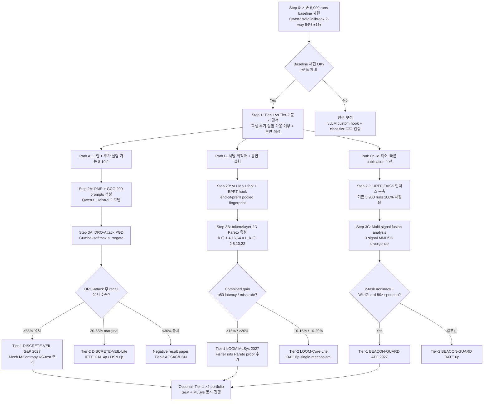

# MoE Expert-Activation Fingerprint — Security & Serving Research Ideation (Session Overview)

> **Date**: 2026-04-24 · **Mode**: 1 (sentence + folder input) · **Lab**: SSU AICA · **Student**: 이방산
>
> **Bundle 형식**: 2026-04-25 R28-R33 신규 hierarchical 적용 (재생성). 학생 / AI 가 본 README + 자기가 진행하려는 idea 파일 1-2 개만 읽어도 (a) 전체 ideation flow 이해, (b) 시작점 결정, (c) Tier 분기 판단 자율 수행 가능.
>
> **이전 단일 파일 summary**: [`../2026-04-24-moe-fingerprint-security-serving.md`](../2026-04-24-moe-fingerprint-security-serving.md) (legacy, 동일 내용 평면화 버전)

---

## 0. Executive Summary

### 0.1 사용자 insight 엄밀 검증 결과 (보안 전문가 관점)

사용자 제시 insight ("no finetune + no extra guard forward + multi-task unified 이면 paper-worthy novelty") 를 S&P / USENIX Security / NDSS 급 novelty-reviewer 관점에서 엄밀 검증한 결과:

- **"No finetune"** 자체는 novelty **아님** — FJD ([arXiv:2509.14558](https://arxiv.org/abs/2509.14558), EMNLP 2025 Findings), HSF ([arXiv:2409.03788](https://arxiv.org/abs/2409.03788)), HiddenDetect ([arXiv:2502.14744](https://arxiv.org/abs/2502.14744)), "Do Internal Layers..." ([arXiv:2510.06594](https://arxiv.org/abs/2510.06594)) 등 training-free dense LLM detection 다수.
- **"No extra guard forward"** 도 novelty **아님** — OmniGuard ([arXiv:2505.23856](https://arxiv.org/abs/2505.23856)) internal representation classifier 120x faster, FJD first-token logit 사실상 추가 forward 0.
- **"Multi-task unified"** 도 약함 — MultiTaskGuard/UniGuard ([arXiv:2504.19333](https://arxiv.org/abs/2504.19333)) multi-task guard 14x + LoRA-shared. **vLLM Semantic Router v0.1 Iris (2026-01 production merge)** 이 jailbreak+domain+PII+fact-check pluggable classifier 를 production 에 merge 완료.

**진짜 paper-worthy novelty** 는 아래 3 축 중 하나 이상 이어야:

1. **MoE discrete routing 의 adaptive-adversarial robustness** (continuous hidden-state probe 는 Obfuscated Activations [arXiv:2412.09565](https://arxiv.org/abs/2412.09565) 에 의해 recall 100→0 붕괴; discrete top-k 는 combinatorial non-differentiable 이라 질적 차이 기대) → **DISCRETE-VEIL'** (Tier-1 S&P).
2. **Token × layer 2D early-exit MoE fingerprint framework** (token prefix length k* 와 layer depth L_k 두 축 Pareto 최적화) → **LOOM'** (Tier-1 MLSys/ASPLOS).
3. **Information-theoretic shared-substrate Pareto proof** — fingerprint Fisher information 을 N task 에 분배하는 systems-theory 축 → **LOOM'** 내부 Section.

### 0.2 Tier-1 Top 3 (Tier-1 main + 1 Tier-2 paper-pair)

| Rank | Title | Score | 링크 |
|------|-------|-------|------|
| 🥇 | **Adversarial Robustness of Discrete Routing in Mixture-of-Experts Jailbreak Detection (DISCRETE-VEIL)** — Tier-1 S&P 2027 (13p) | **8.00** | [tier1/01-discrete-veil.md](tier1/01-discrete-veil.md) |
| 🥈 | **Token × Layer 2D Early-Exit Pareto for Multi-Consumer MoE Fingerprint Serving (LOOM)** — Tier-1 MLSys 2027 / ASPLOS 2027 (18p), LOOM+EMBER+THRESHOLD+TALLY merge | **7.38** | [tier1/02-loom.md](tier1/02-loom.md) |
| 🥉 | **Training-Free Multi-Task Guard via Mixture-of-Experts Routing Fingerprint (BEACON-GUARD)** — Tier-1 USENIX ATC 2027 (12p) / DATE 2027 (6p paper pair with LOOM) | **7.25** | [tier1/03-beacon-guard.md](tier1/03-beacon-guard.md) |

### 0.3 Tier-2 독립 Top 3 (Tier-1 과 동일 detail 수준 유지, R28-α)

| Rank | Title | Score | 링크 |
|------|-------|-------|------|
| T1 | **Embedding-Space PGD on MoE Routing Classifier — Single-Model Precedence Study (DISCRETE-VEIL-Lite)** — IEEE CAL 4p / DSN practical 6p | 7.10 | [tier2/01-discrete-veil-lite.md](tier2/01-discrete-veil-lite.md) |
| T2 | **MoE-Specific Layer-Expert Variance Pruning with SAFEx-Style Interpretability (TALLY-Spinoff)** — DATE 2027 4p WIP | 6.80 | [tier2/02-tally-spinoff.md](tier2/02-tally-spinoff.md) |
| T3 | **Multi-Signal Fingerprint Fusion Geometric Analysis for Two-Task Guard (BEACON-GUARD-Lite DATE fallback)** — DATE 2027 6p | 6.90 | [tier2/03-beacon-guard-date.md](tier2/03-beacon-guard-date.md) |

### 0.4 미선정 아이디어 요약

원안 6 → 최종 3 파이프라인 (+ Tier-2 spinoff 3). EMBER + THRESHOLD + TALLY 단독 → LOOM' 4-mech 으로 merge (artificial split 방지, -7 mechanism). BEACON-GUARD 원안 (Tier-1 USENIX Security) → Tier-2 ATC/DATE 강등 (concurrent 압박). 상세는 [unselected.md](unselected.md).

---

## 1. Ideation Flow Chart (R29 신규)

> 학생 / AI 가 어떤 실험부터 시작하고, 결과에 따라 어느 tier 로 paper 를 만들지 결정할 수 있도록.

### Tier-1 Track 가이드 (가장 유망한 ideation 부터 step-by-step)

**Path A — 가장 유망 (Tier-1 lead, 보안 novelty 최대)**:
- **시작점**: Step 0 baseline 재현 → Step 2A PAIR + GCG 공격 prompts 생성.
- **Tier-1 DISCRETE-VEIL 진입 조건**: Step 3A DRO-Attack 후 Qwen3 WildJailbreak recall ≥ 55% 유지 + Mixtral ≥ 45% 유지 (= "discrete-robust" 가설 성립). hidden-state linear probe 동일 attack 에 0-20% 붕괴 대조 보여 > 30%p 격차 확보.
- **추가 의무 (Tier-1)**:
  - 4 attack 공간 Venn diagram: V-MoE PGD ([OpenReview Fd05J4Bu5Sp](https://openreview.net/pdf?id=Fd05J4Bu5Sp)) / GateBreaker ([arXiv:2512.21008](https://arxiv.org/abs/2512.21008)) / Expert Selections ([arXiv:2602.04105](https://arxiv.org/abs/2602.04105)) / 본 연구 명시적 구분
  - Baseline 8 편: FJD, OmniGuard, WildGuard, HSF, LlamaGuard-3, hidden probe (Obfuscated Activations 재현), Task-Cond Routing, V-MoE PGD text adaptation
  - Mech M2 entropy-sharpening KS-test (defense-in-depth)
- **강조 포인트**: discrete vs continuous adversarial attack surface 의 질적 구분 + Gumbel-softmax surrogate 의 combinatorial hardness 정량화.

**Path B — Tier-1 lead (시스템 novelty + 보안 통합)**:
- **시작점**: Step 0 → Step 2B vLLM v1 fork + EPRT hook.
- **Tier-1 LOOM 진입 조건**: 2D (k*, L_k) Pareto frontier 측정 후 (token=16, L_k=22) 조합에서 detection F1 93%+ + decode p50 -15% + expert miss rate -20%.
- **추가 의무**: Fisher information Pareto proof (systems-theory) + vLLM Semantic Router Iris baseline 재현 + 2-replica mini-cluster SLO 실측.

### Tier-2 Path 가이드

**Tier-2 Path A — DISCRETE-VEIL-Lite (Path A 의 marginal 결과 fallback)**:
- **진입 조건**: DRO-Attack 후 recall 30-55% 구간 (= partial robustness) + Qwen3 단일 모델만 측정.
- **강조 포인트**: "first-to-report MoE embedding-PGD on text routing classifier" precedence claim + IEEE CAL 4p 짧은 measurement study.

**Tier-2 Path C — BEACON-GUARD-Lite DATE fallback**:
- **진입 조건**: Tier-1 ATC 의 multi-task novelty axis 가 vLLM Semantic Router Iris 와 차별화 부족으로 reject 시.
- **강조 포인트**: Multi-signal fusion geometric analysis 단독 + DATE 6p deployment cost 차트 중심.

### Drop / Pivot 가이드

- **DRO-Attack 실패 (recall <30%)** → Negative result paper ("MoE routing 도 adversary 에 취약") ACSAC/DSN tier 로 전환.
- **vLLM hook overhead 너무 큼 (>5ms TTFT add)** → LOOM 의 EPRT 를 batch-level 로 축소 → Tier-2 single-mechanism 으로 강등.

---

## 2. 연구 진행 Meta

### 2.1 Input

- **사용자 쿼리 원문** (한 글자도 변경 없이 인용):
  > "학생 이방산이 260424 MoE fingerprinting 폴더에 정리한 실험 데이터 (summary for presentation + raw data) 를 기반으로 연구 ideation 진행. 가능하면 지금 수준에서 +α 로 실험을 너무 많이 하지 않고 얻을 수 있는 novelty. AI 보안 혹은 모델 서빙 최적화 방향. finetuning-free + no-extra-guard-forward + multi-task 장점이 paper-worthy novelty 인지 보안 전문가 입장에서 엄밀 검증 + 가능한 ideation 방향."
- **Mode**: 1 (sentence + folder input)
- **실행 일시**: 2026-04-24
- **관련 이전 세션**: [2026-04-21 mode1 MoE fingerprinting](../../sessions/2026-04-21-mode1-moe-fingerprinting.md) (전제 다름 — 외부 side-channel 85-90% 가정 vs 본 세션 in-worker forward hook 100% 정확 fingerprint).

### 2.2 접근 방식 (주요 키워드 4-8개)

- **도메인 (A)**: MoE (Mixtral-8x7B, Qwen1.5-MoE-A2.7B, DeepSeek-V2-Lite, Qwen3-30B-A3B), LLM safety, training-free classifier
- **관찰 (B)**: MoE router top-k selection 이 domain/safety signature 를 96.2% / 94% 정확도로 인코딩 (모델 수정 없음)
- **제안 기법 (C)**: expert-activation fingerprint `(L, E)` matrix, k-NN (k=1,5,15,51) / k-means / NC / Rank, FAISS IVF
- **타겟 지표**: (보안) adaptive-attack robustness + jailbreak detection F1 + latency; (서빙) token budget, FLOPs, expert miss rate, TTFT

### 2.3 중점적으로 고려한 축

1. **모델 수정 없음 (training-free)** — 사용자 핵심 요구. 모든 아이디어가 no-finetune + forward 1 회 유지.
2. **Adaptive adversarial robustness** — 보안 novelty 의 진짜 축으로 판정 (DISCRETE-VEIL).
3. **Serving stack integration** — 단일 fingerprint read 로 detection + residency + prefetch (LOOM).
4. **기존 실험 재활용 ≥80%** — 사용자 "+α 최소" 요구 반영. BEACON-GUARD 는 100% 재활용.
5. **Tier-1 + Tier-2 paper-pair 전략** — 동일 core idea 의 Top-tier 13p + Tier-2 4-6p 분리 제출 가능성.

### 2.4 의도적으로 제외한 축 + 이유

| 제외 축 | 이유 |
|---------|------|
| **Hardware accelerator / PIM MoE 가속** | 실측 fingerprint 결과 기반 ideation. HW co-design 은 본 데이터와 거리 + 추가 자원 필요. |
| **Fine-tuning-based safety alignment (RASA / SAFEx)** | 사용자 core premise "no finetune". |
| **Side-channel MoE attack (MoEcho, ExpertEcho)** | 2026-04-21 이전 세션 (FARD-C / ZMSP / PhantomRoute) 이 다룸 — 본 세션은 model-owner in-worker fingerprint 로 성격 다름. |
| **Cross-model fingerprint alignment / Procrustes** | 사용자 실험 데이터 재활용 축 밖. 미래 vector 로 appendix 기록. |
| **VLM/VLA fingerprinting** | 본 실험은 text LLM 4 모델 한정. 2026-04-22 이전 세션 covered. |
| **RLHF / Constitutional alignment** | 사용자 "no finetune" premise 와 상충. |
| **Multi-turn dialogue safety (Crescendo) 단독** | LOOM' 의 M3 admission extension 으로 흡수. |

### 2.5 외부 탐색 범위

- 수집 논문: 약 35 편 (peer-reviewed 13 / arxiv preprint 22)
- Reference Integrity R1: WebSearch + WebFetch fallback 검증, unverified 0 편
- OpenReview verified: 2 편 (V-MoE Adversarial Fd05J4Bu5Sp, FJD RC5x3OkywQ)
- Step 0 Phase 5 축 + novelty-reviewer 추가 search 7 쿼리

### 2.6 평가 기준

- **Tier-1 rubric**: Novelty orthogonal axis / Diff 5+ baseline factorial / Impact broad / Mechanism 2-4 OK
- **Tier-2 rubric**: Novelty first-to-report in narrow scope / Diff 2-3 baseline clear delta / Impact specific engineering gain / Mechanism 1 권장
- **Mechanism budget**: 아이디어당 ≤4 (LOOM' 만 4 = critical merge)
- **Tier budget**: physical ≤3 + software ≤3-4

### 2.7 사용된 전문가 에이전트

- `system-robustness-expert` (메인, 보안 / adversarial robustness 엄밀 검증)
- `ai-optimization-expert` (서빙 최적화 / serving integration)
- 리뷰어: `novelty-reviewer`, `differentiation-reviewer`, `impact-reviewer`

---

## 3. 미선정 아이디어 짧은 요약

상세는 [unselected.md](unselected.md):

- **EMBER (원안)** → MERGED to LOOM' M2 (early-exit axis 중복)
- **THRESHOLD (원안)** → DROP, LOOM' M2 token-axis 흡수
- **TALLY (단독 NeurIPS Sys)** → DOWNGRADED to LOOM' M4 + DATE 4p WIP spinoff
- **BEACON-GUARD (Tier-1 USENIX Security 원안)** → DOWNGRADED to Tier-2 ATC/DATE
- **BEACON-GUARD Mech 2.2 OOD-distance gate** → ABSORBED into DISCRETE-VEIL' defense-in-depth

---

## 4. 참고 / 관련 자료

- **상세 Phase 로그**: [`sessions/2026-04-24-mode1-moe-fingerprint-security-serving.md`](../../sessions/2026-04-24-mode1-moe-fingerprint-security-serving.md)
- **이전 단일 파일 summary (legacy 호환)**: [`../2026-04-24-moe-fingerprint-security-serving.md`](../2026-04-24-moe-fingerprint-security-serving.md)
- **관련 이전 세션**: [2026-04-21 mode1 MoE fingerprinting](../../sessions/2026-04-21-mode1-moe-fingerprinting.md)
- **OpenReview verified**: V-MoE Adversarial [Fd05J4Bu5Sp](https://openreview.net/pdf?id=Fd05J4Bu5Sp), FJD [RC5x3OkywQ](https://openreview.net/forum?id=RC5x3OkywQ)
- **wiki entry 들**: `__research_wiki/ideas.md`, `papers.md`, `concepts.md`, `index.md`, `README.md`
