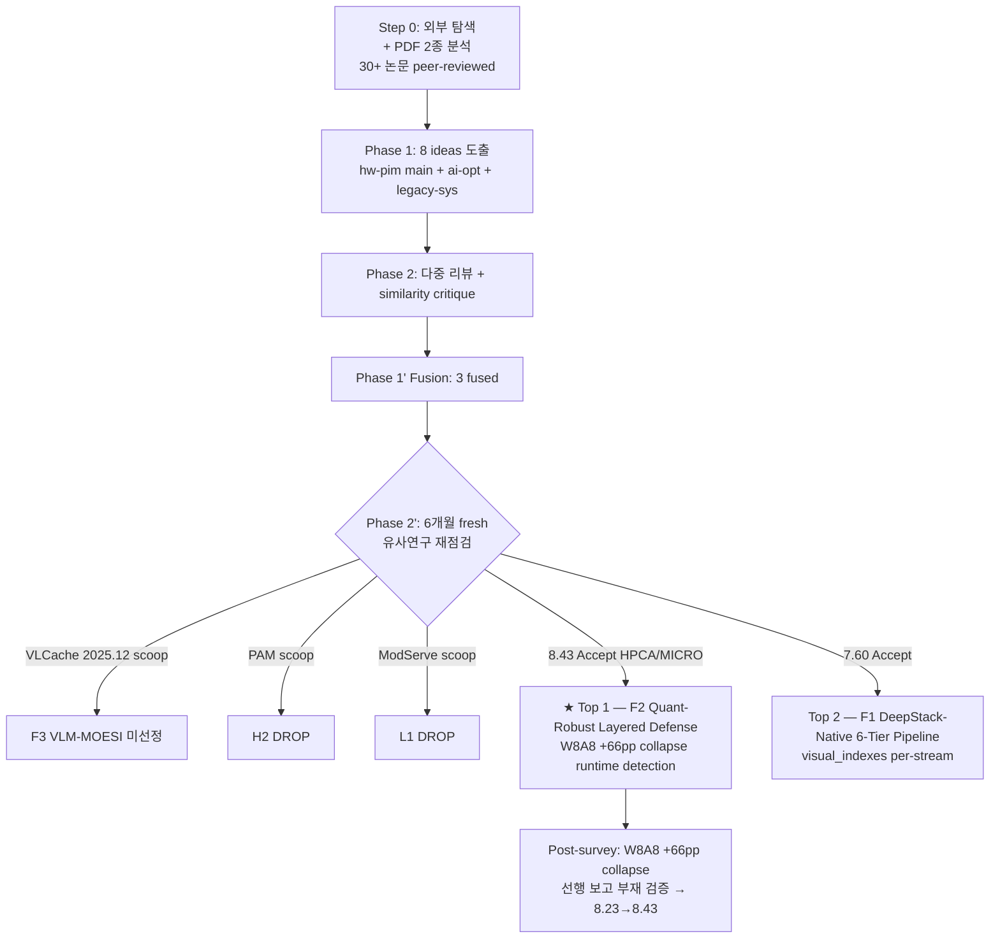

# Session 2026-04-22 — Mode 2 — VLM+PIM 연구 보완·확장 아이디어 도출

## Ideation Flow Chart (R29 retrofit)

> AttAcc baseline (ASPLOS'24) + Qwen3-VL-4B-Instruct, VLM_exploration_PIM_260407 motivation + PIM_260422 미팅자료 기반.

---

## Meta
- **User request**: "/home/yhgong/paper/vlm 내에 있는 pdf 로된 미팅자료들을 분석하고 vlm 가속 및 에너지효율성에 대한 연구 ideation 혹은 현재 진행중인 부분에서 보완할점 등을 탐색"
- **Mode**: 2 (local PDFs)
- **Inputs**:
  - `/home/yhgong/paper/vlm/VLM_exploration_PIM_260407.pdf` (연구자, 2026-04-07, 36 pages) — 초기 motivation 자료
  - `/home/yhgong/paper/vlm/PIM_260422_미팅자료.pdf` (연구자, 2026-04-22, 38 pages) — 최신 실험 결과 + simulator 수정 계획
- **Experts participated**: hw-pim-accelerator-expert (primary), ai-optimization-expert (primary), legacy-system-expert (sub)
- **Reviewers**: novelty-reviewer, differentiation-reviewer, impact-reviewer + similarity-critique agent
- **Papers analyzed**: 30+ (external arxiv + internal PDFs)
- **Ideas generated**: 8 (Phase 1) → 3 fused (Phase 1') → **Top 2 selected + 1 미선정 (Phase 2'/1'')**
- **Output target**: 본 연구의 "VLM-aware Heterogeneous KV Management for GPU+PIM Systems" (AttAcc ASPLOS'24 baseline, Qwen3-VL-4B-Instruct)을 보완·확장하는 defensible 연구주제

---

## Executive Summary

> 연구자/학생이 Phase 1~1'' 상세 로그를 읽기 전 **Top-M 아이디어의 구조와 근거, 그리고 Exploration 과정에서 나온 모든 아이디어의 연구 GAP·제안 overview·미선정 사유**를 한눈에 파악할 수 있도록 정리한 요약. 상세 내용은 Phase 별 섹션 (Section 3 Phase 1 / Section 4 Phase 2 / Section 5 Phase 1' / Section 6 Phase 2' / Section 7 Phase 1'') 참조.

### Top 1 — F2 Quantization-Robust Layered Defense for VLM-PIM (평균 score **8.43**, Phase 2' 판정: **Accept**, Target Venue: **HPCA 2026 / MICRO 2026**)

**기본 전제 (Premise)**
- VLM W8A8 양자화 시 layer-wise visual attention 이 5.73% → 72.58% (+66pp) 로 extreme collapse (본 연구 E5 측정).
- Weight-only INT4/INT8 은 Δ<0.1pp 로 pattern 보존 — **activation quantization** 이 분포 파괴의 핵심 (FP8-Dynamic 도 -4.17pp opposite collapse).
- FP16 L27 Q·Kᵀ > 65504 token 3.2% overflow — VLM 긴 sequence (L≥1000) 에서 LM head 직전 sharpened representation 의 FP16 5-bit exponent 한계.
- Aggregate corr 0.996 (stable) vs individual sample min 0.357 (catastrophic masking) — per-sample fragility 가 aggregate 평균에 숨음.

**기존 연구가 touch 하지 못한 GAP**
- MBQ ([arXiv:2412.19509](https://arxiv.org/abs/2412.19509), CVPR'25) 는 gradient sensitivity (vision 10× 둔감) 만 정량화, layer-wise attention ratio 미측정. "W8A8 nearly lossless" 는 task accuracy 기준이며 attention distribution 붕괴와 양립.
- P3-LLM ([arXiv:2511.06838](https://arxiv.org/abs/2511.06838)) 은 static per-layer precision + calibration-free smoothing — **runtime collapse detection** 및 BF16 fallback path 부재.
- AKVQ-VL ([arXiv:2501.15021](https://arxiv.org/abs/2501.15021)), VL-Cache ([arXiv:2410.23317](https://arxiv.org/abs/2410.23317)) 는 layer-level policy — **sample-level granularity** 미탐구.
- LLM.int8 ([arXiv:2208.07339](https://arxiv.org/abs/2208.07339)) 의 outlier → softmax mass 영향 관찰은 text-LLM 전용 + extreme 값 (+66pp) 보고 없음.
- Post-literature survey: Qwen-VL + W8A8 + attention ratio 정량화는 **완전 공백**. +66pp collapse 선행 보고 부재 → **measurement contribution**.

**제안 기법 Overview**
- (HW layer granularity) AttAcc simulator macro 내부에 per-layer KL comparator (W8A8 output vs weight-only-INT8 shadow output) 추가 → KL > threshold 시 해당 layer 를 BF16 dedicated path 로 escalation.
- (HW numerical safety) L27 self-attn 의 Q·Kᵀ abs_max 가 FP16 max 근접 시 즉시 BF16 rescue.
- (SW sample granularity) L0-L1 probe 로 per-sample fragility score 계산 (LR classifier, 입력 feature ≤10차원, <3% FLOPs). W8A8 shadow inference 를 처음 4 layer 만 실행 → weight-only-INT8 와의 KL divergence 로 fragility 분류.
- (Policy dispatcher) stable 85% → 4-B Layer-Adaptive PIM placement / fragile 10-15% → L17-21 peak layer GPU HBM 강제 + 나머지 PIM / highly fragile 2% → full GPU attn.
- (cross-granularity layered defense) HW detector (layer) + SW gating (sample) 이 서로 다른 granularity 에서 복합 방어.

**예상 효과 (보수)**
| 지표 | Baseline | F2 목표 | 조건 |
|------|----------|--------|------|
| W8A8 MMMU accuracy drop | -12.4% (collapse) | **-1.5~-2.5%** | Qwen3-VL-4B 에서 detector + BF16 fallback 활성 |
| FP16 L27 overflow rate | 3.2% token | **<0.3%** (10× reduction) | L≥1000 long-sequence, bf16 escalation |
| Per-sample worst-case corr | 0.357 (individual min) | **0.70-0.80** (2× robustness) | 10-15% fragile 요청 conservative fallback |
| Macro area overhead | — | **<3%** | RTL-level estimation on AttAcc sim |
| Latency overhead | — | **<5%** | L0-L1 probe + async KL |

**Scoring 및 이유**
| Axis | Score | 근거 |
|------|-------|------|
| Novelty | **8.5** | (a) +66pp W8A8 collapse 정량화 **최초** (post-literature survey 검증, MBQ/Q-VLM/VLMQ/MQuant/AKVQ-VL/LLM.int8 전체 측정 부재); (b) 3-mechanism triangulation (outlier + sink + rotation-invariance) 첫 통합 설명; (c) per-sample fragility gating 축 empty. |
| Differentiation | **8.5** | HW (layer granularity) × SW (sample granularity) **cross-granularity layered defense** 는 VLM PIM 문헌에 없음. P3-LLM (static), MBQ (calibration), AKVQ-VL (layer-level) 모두 single-granularity 로 orthogonal. |
| Impact | **8.3** | Edge VLM 배포 urgent (MXFP4/NVFP4 precision 전쟁 2026), Samsung/SK Hynix 차세대 product roadmap 직결. HW + quantization + systems 3개 community cross-citation 가능. |
| 전문가 합의 | Algo ✅ / HW ✅ / System ◯ | Algo: per-sample fragility probe 는 알고리즘 기여. HW: KL detector macro + BF16 path 는 전형적 HW 기여. System: HW-SW 인터페이스 프로토콜 명시 조건부 Accept. |

**→ Phase 상세**: [Section 5 F2](#section-5--phase-1-전문가-1차-refinement--fusion) / [Section 6 F2 score delta](#section-6--phase-2-2차-리뷰--6개월-fresh-유사연구-재점검) / [Section 10.5 post-literature survey](#section-105--post-hoc-literature-survey-w8a8-visual-attention-collapse-선행-보고-검증)

---

### Top 2 — F1 DeepStack-Native Prefill-Decode Pipeline with 6-Tier KV Tiering (평균 score **7.60**, Phase 2' 판정: **Conditional Accept**, Target Venue: **ASPLOS 2026 / MLSys 2026**)

**기본 전제 (Premise)**
- Qwen3-VL DeepStack 아키텍처는 ViT 중간 layer 출력을 LLM [L4, L8, L12] 에 inject — visual 정보가 self-attn 으로 확산되며 L17-21 peak (24.5%) 형성 (본 연구 E4 측정).
- E1 측정: chunked prefill C≤32 구간에서 Arithmetic Intensity < 60 → 강 memory-bound. E2: C=16 에서 PIM attn 50× / E2E 1.53× gain.
- Video L=8948 에서 PIM 0.81× regression (break-even ≈ L 2K).
- 5-model 비교 (Qwen3-VL/Qwen2.5-VL/InternVL3/Qwen3.5/Mllama) — dense family dense band 공통, cross-attn/hybrid linear 는 아키텍처별 대응 필요.

**기존 연구가 touch 하지 못한 GAP**
- AttAcc ([ASPLOS 2024], 본 연구 baseline) 은 **decode-only PIM** — prefill 은 simulator 상에서 GPU route, chunked prefill PIM 평가 불가.
- STARC ([arXiv:2505.05772](https://arxiv.org/abs/2505.05772)) 는 AttAcc sim 공유하지만 token clustering bank remapping — **layer-topology dispatch** 와 orthogonal axis.
- VLCache ([arXiv:2512.12977](https://arxiv.org/abs/2512.12977)) 는 attention sparsity 기반 tier — **DeepStack inject topology 기반 tier** 미탐구.
- VL-Cache ([arXiv:2410.23317](https://arxiv.org/abs/2410.23317)) 는 layer-adaptive budget SW — HW placement 축 부재.
- Jenga ([arXiv:2503.18292](https://arxiv.org/abs/2503.18292)) 는 generic heterogeneous arch — **VLM DeepStack-specific vision injection** 미대응.
- PAM ([arXiv:2602.11521](https://arxiv.org/abs/2602.11521)) 은 text-LLM 3-tier — **visual token 고유 비대칭** 미대응.

**제안 기법 Overview**
- (Simulator extension) AttAcc 4-file mod (config/system/model/ramulator_wrapper) — 본 연구 P1 작업과 공통 인프라. Chunked prefill m=1 GEMV decomposition 으로 PIM m=1 accumulator 구조 재사용.
- (6-tier KV placement) DeepStack inject [L4, L8, L12] + L17-21 peak + L27 overflow 기준 6-tier 정의: Tier 0 pre-inject (L0-L3) / Tier 1-3 post-inject intermediate / Tier 4 L17-21 peak = GPU HBM full bf16 / Tier 5 L22-L27 tail = BF16 escalation.
- (AI inflection dispatch) C∈{8,16,32,64} chunk 별 AI 를 측정 후 AI < 60 구간만 PIM route, video L=8948 regression 구간에서 C=8 adaptive fallback.
- (Per-tier compression) Tier 0/5 INT4 weight-only / Tier 1-3 aggressive eviction 60-80% / Tier 4 GPU HBM bf16 강제 / L27 numerical safety.
- (Cross-request ViT reuse) 같은 image 의 L4/L8/L12 inject 는 ViT 출력 cache — 4-C 연장.
- (A3 adapter 흡수) Mllama cross-attn 은 PIM immutable region / Qwen3.5 hybrid linear 는 KV skip — 5-family generalization.

**예상 효과 (보수)**
| 지표 | Baseline | F1 목표 | 조건 |
|------|----------|--------|------|
| E2E prefill latency (Qwen3-VL-4B, L=4096) | AttAcc 1.00× | **0.62-0.69× (1.45-1.60× speedup)** | 672×672, C=16, BS=8 |
| TTFT (chunked C=16) | AttAcc 1.00× | **0.55-0.65× (1.53-1.80×)** | prefill-dominated workload |
| Decode throughput | 1.00× | **1.20-1.30×** | decode-heavy |
| Video L=8948 | 0.81× (regression) | **0.95-1.05× (regression 회복)** | C=8 adaptive fallback |
| FHD TTFT | 1,285ms | **650-800ms** | BS=8, 1920×1080 |

**Scoring 및 이유**
| Axis | Score | 근거 |
|------|-------|------|
| Novelty | **7.0** | DeepStack inject topology × AI inflection 교집합 tier 는 unique; 단 Focus/V-Rex (HPCA'26) 등 VLM HW accelerator concurrent work 존재 — incremental risk. |
| Differentiation | **8.0** | STARC (token clustering), VLCache (attention sparsity), Jenga (generic), PAM (text-LLM) 모두 축 다름. C-adaptive dispatcher + video regression 회복은 unique. |
| Impact | **7.8** | AttAcc follow-up 으로 자연 positioning, production chunked prefill default + VLM 상용화 타이밍 매치. 5-model generalization 으로 industry relevance 확보. DeepStack 의존성이 일반화 risk (Impact 8.0 → 7.8 하향). |
| 전문가 합의 | Algo ✅ / HW ◯ / System ✅ | Algo: tier boundary 가 학습 대상. HW: 측정 재현성 조건부. System: ASPLOS end-to-end serving 적합. |

**→ Phase 상세**: [Section 5 F1](#section-5--phase-1-전문가-1차-refinement--fusion) / [Section 6 F1 score delta](#section-6--phase-2-2차-리뷰--6개월-fresh-유사연구-재점검)

---

### Exploration 요약 (Top-M 외 모든 아이디어 — Phase 상세 읽기 전 판단용)

> Phase 1 에서 8개 아이디어 도출 → Phase 1' 에서 3 fused (F1/F2/F3) 로 재구성 + 2개 DROP → Phase 2' 에서 F3 Major Revision. 아래는 Phase 1 각 초안 + Fused F3 의 한눈 요약. 상세 미선정 사유 · 재방문 조건은 [Section 9 미선정 로그 (ideas.md 하단)](#section-9--다음-단계-제안) 및 ideas.md 미선정 섹션 참조.

#### H1 DeepStack-Aware Chunked-Prefill PIM Extension — **F1 로 흡수**
- **연구 GAP**: AttAcc 원본 simulator 가 decode-only — DeepStack inject layer 경계에서 chunk boundary 재조정 + PIM dispatch 동적 스위칭 미탐구.
- **제안 overview**: AttAcc simulator prefill path 확장, DeepStack inject [4,8,12] 경계에서 chunk size 재계산, PIM route dynamic dispatch. C1 TTFT 정면 해결 (E1 C≤32 AI<60, E2 C=16 E2E 1.53×).
- **Top-M 반영**: 독립 통과 borderline (Novelty 5, Sarathi-Serve/IANUS 대비 incremental) → A2 흡수하여 **F1 Top 2** 로 승격.

#### H2 Hierarchical 3-Tier KV (GPU HBM / PIM bank / CXL-SSD) — **DROP (SCOOP)**
- **연구 GAP**: Video L=8948 에서 PIM 0.81× regression — cold KV 를 CXL 로, hot 을 PIM 으로, peak 을 HBM 으로 length-adaptive 계층화 필요.
- **제안 overview**: 3-tier hierarchy + length-adaptive promotion policy, video long-context 회복 타겟.
- **미선정 사유**: **PAM ([arXiv:2602.11521](https://arxiv.org/abs/2602.11521), 2026.02) 이 HBM-PIM + DRAM-PIM + SSD-PIM 3-tier + context locality migration + PAMattention 모두 선점 (~75-80% 메커니즘 일치)**. FlexGen/InfiniGen/LoL-PIM 까지 3-tier 포화 — 단독 통과 불가. F1 의 "C-adaptive dispatcher video mode" 로 기능 일부 흡수.

#### H3 Quantization-Robust Pattern-Fallback PIM Macro — **F2 로 흡수**
- **연구 GAP**: W8A8 pattern collapse 는 HW level 에서 감지/대응할 수 있는가? FP16 L27 overflow 에 HW numerical safety net 있는가?
- **제안 overview**: W4A16 기본 + per-layer W8A8 collapse detector (KL divergence monitor) + BF16 fallback path HW macro. Runtime dynamic precision escalation.
- **Top-M 반영**: Novelty 6, Diff 8 독립 통과 후보 → A1 (SW sample granularity) 와 fusion 시 cross-granularity novelty 확보 → **F2 Top 1** 으로 승격.

#### A1 PatternGuard Per-Sample Fragility Gating — **F2 로 흡수**
- **연구 GAP**: E3 individual min corr 0.357 — aggregate 0.996 stable 뒤에 숨은 per-sample catastrophic masking. VL-Cache/AKVQ-VL 모두 layer-level, per-sample gating 축 empty.
- **제안 overview**: L0-L1 probe + W8A8 vs weight-only-INT8 KL disagreement signal 로 fragile 10-15% 요청 감지 → conservative GPU fallback. Stable 85% 만 PIM layer-adaptive placement 적용.
- **Top-M 반영**: Novelty 8 독립 최고점 but H3 와 역할 중복 우려 → H3 (HW layer granularity) + A1 (SW sample granularity) fusion → **F2 Top 1** (cross-granularity layered defense).

#### A2 InjectScope DeepStack-Native 6-Tier KV — **F1 로 흡수**
- **연구 GAP**: DeepStack inject [4,8,12] + L17-21 peak + L27 overflow 의 구조적 경계를 KV tier boundary 로 활용한 선행 연구 없음.
- **제안 overview**: 6-tier KV placement (pre-inject / post-inject-1/2/3 / peak / tail) + per-tier precision · eviction rate 차등 + cross-request ViT feature reuse.
- **Top-M 반영**: VLCache (2025.12) concurrent (~45-55%) → DeepStack topology binding 으로 narrow + H1 (prefill dispatch) 와 fusion → **F1 Top 2**.

#### A3 ArchAware-Adapter Cross-Architecture Unified KV — **F1 evaluation generalization 섹션으로 흡수**
- **연구 GAP**: 5-model 이질 아키텍처 (dense self-attn / cross-attn / hybrid linear) 를 관통하는 통합 KV policy adapter 부재.
- **제안 overview**: Mllama cross-attn visual K/V → PIM immutable region, Qwen3.5 hybrid linear → linear layer KV skip. Architecture fingerprint dispatcher.
- **Top-M 반영**: Novelty 7 but Jenga ([arXiv:2503.18292](https://arxiv.org/abs/2503.18292)) concurrent (~50-60%) + 5-model scale 부족 → 독립 논문 대신 F1 의 "5-family generalization 모듈" 로 흡수.

#### L1 VLM-SLO Admission Control & Dual-Pool Batching — **DROP (SCOOP)**
- **연구 GAP**: MMMU p99 TTFT 12.4× tail 에 dual-pool (visual-heavy vs text-heavy) + M/G/1 analytical bound admission control 부재.
- **제안 overview**: 2개 admission pool + classic M/G/1 queueing 기반 SLO-aware admission + chunked-prefill merger.
- **미선정 사유**: **ModServe ([arXiv:2502.00937](https://arxiv.org/abs/2502.00937), 2025.02) modality-aware disaggregation + RPS-Serve ([arXiv:2603.26498](https://arxiv.org/abs/2603.26498), 2026.03) Rocks/Pebbles/Sand + Dual-Pool Token-Budget Routing ([arXiv:2604.08075](https://arxiv.org/abs/2604.08075), 2026.04) 3편이 80%+ 선점**. VLM serving scheduling 레드오션. F1 dispatcher 내부 "PIM bank contention-aware admission" sub-component 로 일부 흡수 가능.

#### L2 GPU↔PIM KV Migration + VLM-MOESI — **F3 로 refined → F3 는 Major Revision 미선정**
- **연구 GAP**: 4-C Cross-Request Image Sharing 의 invalidation protocol 부재. Cross-request image 변경 시 공유 KV coherence state machine 없음.
- **제안 overview**: Image-hash (pHash 64-bit + SimHash verification) granularity 의 MOESI 5-state (Modified/Owned/Exclusive/Shared/Invalid) coherence protocol — GPU-HBM ↔ PIM-DRAM 간.
- **F3 refine 후 미선정 사유**: Phase 2' 6-month fresh similarity search 에서 **VLCache ([arXiv:2512.12977](https://arxiv.org/abs/2512.12977), 2025.12) 신규 arxiv 논문이 image-hash 기반 encoder/KV cache 재사용을 SGLang 에 구현 + 1.2-16× TTFT speedup 실증 → ~70-75% scoop on refined claim**. Major Revision 판정 — "KV 재사용" 포기 후 "coherence traffic 감소 / invalidation cost / write-back bandwidth" 축으로 전면 피벗 조건부 2-4주 후 재세션 권고.

---

**Top-M 선정 기준 요약** (Section 7 Phase 1'' 에서 적용):
- Novelty + Differentiation + Impact 평균 ≥ 7.0 + Phase 2' 판정 Accept/Conditional Accept + 실험 feasibility (2×A6000 + AttAcc sim) 충족.
- F3 는 score 평균 6.17 + Major Revision 판정 → 이번 세션 미선정, narrative 피벗 후 재진입 예정.

---

## Section 0 — 현재 연구 상태 (PDF 2종 분석)

### PDF-A: VLM_exploration_PIM_260407.pdf (motivation paper)

**논문 제목**: "VLM-aware Heterogeneous KV Management for GPU+PIM Systems — Exploiting Visual/Text KV Asymmetry in VLM Inference on PIM-augmented GPUs"

**Baseline**: AttAcc (ASPLOS 2024) | **Model**: Qwen3-4B (LLM) / Qwen3-VL-4B-Instruct (VLM)

**3 Challenges**:
| ID | 설명 | 측정 근거 (PDF-A) |
|----|------|--------------------|
| **C1** TTFT Explosion | VLM prefill이 LLM 대비 수~수십배 길어 TTFT 폭증 | 672x672 BS=8 server: 353ms vs 56ms = 6.13×; FHD BS=16: 10.38×; MMMU real: 12.4× |
| **C2** Layer Asymmetry | Visual KV가 seq의 86.2% 차지하지만 attention의 11.4%만 받음 — BW 7.6× over-consumption | L0-7 avg 2.6%, L17-21 avg 24.5%, peak L18=30.7%; worst-case waste L7=116.5× |
| **C3** Capacity Saturation | Visual KV size 거대로 batch capacity 붕괴 + bank imbalance | FHD KV=305MB/req (LLM 18MB의 17×); mixed 50% VLM에서 bank imbalance 13.62× |

**3 Solutions** (현재 설계):
- **4-A**: VLM-aware Heterogeneous Scheduling — ViT encoding(GPU, 30-85ms) 동안 PIM은 다른 request의 decode attention 처리. C1 타겟.
- **4-B**: Layer-Adaptive KV Placement — dense layer(L17-21) visual KV → PIM bank, sparse layer(L0-7) → GPU HBM. C2 타겟.
- **4-C**: Bank Balancing + Cross-Request Image Sharing — visual KV spreading across BGs + image-hash 기반 shared visual KV. C3 타겟.

### PDF-B: PIM_260422_미팅자료.pdf (최신 실험)

**핵심 Discovery: FP16 → BF16 migration 강제**
- Qwen3-VL L≥1000 sample에서 L27 self-attn의 Q·Kᵀ abs_max가 FP16 최대값 65,504 초과 → softmax(exp(∞)) → NaN
- BF16(exponent 8-bit)은 동일 입력에서 L27 abs_max=860으로 finite
- 원인: FP16 exponent 5-bit 한계; L27은 LM head 직전 sharpened representation
- 수정: 모든 script `torch_dtype=torch.bfloat16` 강제

**E1-E5 실험 결과 (bf16 기준)**:
| 실험 | 설정 | 핵심 결과 |
|------|------|----------|
| **E1** Chunked prefill GPU profile | synthetic Q/K/V, C∈{4,16,64,128,256,512}, A6000 실측 | C=4 SDPA 870ms (full prefill 33ms의 26×); C≤32에서 AI<60 강하게 memory-bound |
| **E2** PIM analytical gain | AttAcc HBM3 config (18.1 TB/s effective), NVLink3 210 GB/s | C=16 기준 PIM attn 50× vs chunked SDPA; E2E prefill 1.53× (672²); video L=8948에서 0.81× (regression) |
| **E3** Pattern robustness | MMMU n=125, Qwen3-VL-4B | Subset-mean corr 0.9964 (aggregate stable); sample-to-full corr mean 0.834 / **min 0.357** (sample-level noise 큼) |
| **E4** 5-model comparison | Qwen3-VL/Qwen2.5-VL/InternVL3/Qwen3.5/Llama-3.2-V | Qwen3-VL/Qwen2.5-VL/InternVL3 dense band 공통, peak 위치만 다름; Mllama는 cross-attn (self-attn visual 0.85%); Qwen3.5는 hybrid linear (48/64 layer linear, KV 무관) |
| **E5** Quantization impact | RedHatAI W8A8, AWQ W4A16, FP8 | **W8A8 pattern collapse** (visual attn 5.73% → 72.58%, +66.85pp); weight-only INT4/INT8은 Δ<0.1pp 보존; FP8-Dynamic은 반대 방향 collapse (-4.17pp) |

**AttAcc simulator 상태**: 현재 decode-only (prefill은 GPU routing). prefill PIM feasibility 검증 위해 4 파일 수정 필요 (config/system/model/ramulator_wrapper) — 계획됨.

**P1-P3 Next Steps** (본 연구 예정):
- **P1**: AttAcc simulator 수정 (prefill PIM 지원) — 1주 예상
- **P2**: Cross-dataset E3 확장 (COCO, DocVQA, ChartQA)
- **P3**: E4 full 200 samples + InternVL3 late-peak 통계 검증
- **P3**: Video-range PIM 대안 (hierarchical KV) 탐색

### 분석 관점 — 보완할 점 탐색 축

본 연구의 **아직 열려있는 gap**:
1. **Prefill PIM feasibility** — simulator는 decode-only, chunked prefill 확장 필요 (P1)
2. **Individual sample corr 0.357** — aggregate stable이지만 per-sample catastrophic miss 리스크 (policy fragility)
3. **W8A8 collapse vs weight-only 보존** — pattern과 quantization robustness의 관계 미탐구
4. **FP16 L27 overflow** — VLM-specific numerical safety 이슈로 HW macro level safety net 없음
5. **Video L=8948 regression** — hierarchical KV 미설계
6. **DeepStack Qwen3-VL multi-inject** — L17-21 peak의 원인 가설이지만 scheduling/KV policy에 반영되지 않음
7. **5-model cross-validation** — 아키텍처 diversity(dense/cross-attn/hybrid)에 공통 정책 부재
8. **Cross-request image sharing의 invalidation protocol** — 4-C는 sharing 제안하지만 공유 KV의 coherence state machine 부재

---

## Section 1 — Step 0: 외부 최신 논문 탐색 (primary source)

### 1.1 HW/PIM/Accelerator 논문 (18편)

**SCOOP/Concurrent RISK 그룹** (긴급 대응 필요):

| # | 논문 | Venue | arxiv | Relevance |
|---|------|-------|-------|-----------|
| S1 | **Focus: A Streaming Concentration Architecture for Efficient VLM** | HPCA 2026 (Best Paper Candidate) | [arXiv:2512.14661](https://arxiv.org/abs/2512.14661) | 🚨 VLM systolic 3-level hierarchical compression, 2.4× speedup / 3.3× energy. 본 연구의 C2 Layer Asymmetry와 동일 관찰. Duke 그룹. |
| S2 | **ORCHES: Orchestrated Test-Time-Compute-based LLM on GPU-PIM** | MICRO 2025 | — (DOI 10.1145/3725843.3756039) | 🚨 GPU-PIM 협업, vision reasoning 3.10×, adaptive workload assignment + branch-aware pipelining |
| S3 | **V-Rex: Real-Time Streaming Video LLM on Edge Accelerator** | HPCA 2026 | [arXiv:2512.12284](https://arxiv.org/abs/2512.12284) | 🚨 Video KV retrieval (temporal/spatial similarity), AGX Orin 대비 1.9-19.7× speedup. 본 연구의 video L=8948 regression 문제를 정면. KAIST. |
| S4 | HPIM: Heterogeneous Processing-In-Memory | arxiv 2025.09 | [arXiv:2509.12993](https://arxiv.org/abs/2509.12993) | SRAM-PIM + HBM-PIM 2-tier, A100 대비 22.8× |

**VLM-specific SW** (concurrent):

| # | 논문 | Venue | arxiv | Relevance |
|---|------|-------|-------|-----------|
| V1 | **VL-Cache: Sparsity and Modality-Aware KV Compression** | ICLR 2025 | [arXiv:2410.23317](https://arxiv.org/abs/2410.23317) | 🚨 Layer-adaptive sparsity-aware budget allocation — 본 연구의 4-B의 SW 원형. Amazon. |
| V2 | Nova: Adaptive Cross-Stage Parallelization for agentic VLM | arxiv 2025.09 | [arXiv:2509.21301](https://arxiv.org/abs/2509.21301) | EPD 3-stage overlap |
| V3 | ModServe: Modality-aware disaggregation | arxiv 2025.02 | [arXiv:2502.00937](https://arxiv.org/abs/2502.00937) | P99 TTFT 20-50% 감소 |
| V4 | MPIC: Position-Independent Multimodal Context Caching | arxiv 2025.02 | [arXiv:2502.01960](https://arxiv.org/abs/2502.01960) | Cross-request visual KV 재사용 |
| V5 | **VLCache: 2% Vision Token Computation + 98% Reuse** | arxiv 2025.12 | [arXiv:2512.12977](https://arxiv.org/abs/2512.12977) | 🚨 image-hash 기반 encoder/KV cache 재사용, SGLang, 1.2-16× TTFT. F3 scoop source. |

**GPU+PIM Heterogeneous Systems**:

| # | 논문 | Venue | arxiv | Relevance |
|---|------|-------|-------|-----------|
| H1 | **PAM: Processing Across Memory Hierarchy** | arxiv 2026.02 | [arXiv:2602.11521](https://arxiv.org/abs/2602.11521) | 🚨 HBM-PIM + DRAM-PIM + SSD-PIM 3-tier, 12.88×. H2 scoop source. |
| H2 | PIMphony/LoL-PIM: Overcoming BW & Capacity Inefficiency | HPCA 2026 | [arXiv:2412.20166](https://arxiv.org/abs/2412.20166) | Token-Centric Partitioning, xPU+PIM 8.4× |
| H3 | AQPIM: In-Memory Activation Quantization | HPCA 2026 | — | PIM bank activation quant |
| H4 | Pimba: Post-Transformer LLM Serving PIM | MICRO 2025 | [arXiv:2507.10178](https://arxiv.org/abs/2507.10178) | Mamba/SSM PIM; Qwen3.5 hybrid linear baseline |
| H5 | **STARC: Sparse Attention Remapping with Clustering** | arxiv 2025.05 | [arXiv:2505.05772](https://arxiv.org/abs/2505.05772) | 🚨 AttAcc simulator 사용, bank remapping. F1 baseline 필수. |
| H6 | **P3-LLM: NPU-PIM Mixed Precision** | arxiv 2025.11 | [arXiv:2511.06838](https://arxiv.org/abs/2511.06838) | W4 weight + W8 activation + dynamic smoothing. F2 concurrent. |
| H7 | LongSight: Compute-enabled Memory for 1M Context | MICRO 2025 | — | Dense+sparse hybrid attention, CXL |
| H8 | Oaken: Hybrid KV Quantization | ISCA 2025 | [arXiv:2503.18599](https://arxiv.org/abs/2503.18599) | KAIST Park Jongse 그룹; AttAcc follow-up |

**Visual Token Reduction / Algorithm**:

| # | 논문 | Venue | arxiv | Relevance |
|---|------|-------|-------|-----------|
| T1 | FastV: Early-exit visual token drop | ECCV 2024 | [arXiv:2403.06764](https://arxiv.org/abs/2403.06764) | Uniform drop baseline |
| T2 | SparseVLM: Text-guided sparsification | ICML 2025 | [arXiv:2410.04417](https://arxiv.org/abs/2410.04417) | Per-layer ratio, sample 미보정 |
| T3 | SparseVILA: Prefill/decode split | ICCV 2025 | [arXiv:2510.17777](https://arxiv.org/abs/2510.17777) | Adaptive granularity |
| T4 | MBQ: Modality-balanced VLM Quant | CVPR 2025 | [arXiv:2412.19509](https://arxiv.org/abs/2412.19509) | Calibration sensitivity |
| T5 | **AKVQ-VL: Attention-aware Saliency VLM KV Quant** | arxiv 2025.01 | [arXiv:2501.15021](https://arxiv.org/abs/2501.15021) | Per-layer bit budget, F2 baseline |
| T6 | DeepStack: Multi-layer Visual Injection | NeurIPS 2024 | [arXiv:2406.04334](https://arxiv.org/abs/2406.04334) | Qwen3-VL 아키텍처 원조. 본 연구의 L17-21 peak 원인 가설. |

**Serving/Scheduling** (L1 drop 관련):

| # | 논문 | Venue | arxiv | Relevance |
|---|------|-------|-------|-----------|
| SV1 | Sarathi-Serve: Chunked Prefill | OSDI 2024 | [arXiv:2403.02310](https://arxiv.org/abs/2403.02310) | Chunked prefill 원조 |
| SV2 | **RPS-Serve (Rocks/Pebbles/Sand)** | arxiv 2026.03 | [arXiv:2603.26498](https://arxiv.org/abs/2603.26498) | 🚨 Video/image/text 3-tier scheduling, MMMU TTFT tail. L1 scoop source. |
| SV3 | ElasticMM: modality-aware load balancer | arxiv 2025.07 | [arXiv:2507.10069](https://arxiv.org/abs/2507.10069) | Unified multimodal prefix caching |
| SV4 | Dual-Pool Token-Budget Routing | arxiv 2026.04 | [arXiv:2604.08075](https://arxiv.org/abs/2604.08075) | L1 scoop source 2 |
| SV5 | PolyServe: admission control | arxiv 2025.07 | [arXiv:2507.17769](https://arxiv.org/abs/2507.17769) | Iteration time 예측 |
| SV6 | CacheBlend / DroidSpeak | 2024-25 | [arXiv:2405.16444](https://arxiv.org/abs/2405.16444), [arXiv:2411.02820](https://arxiv.org/abs/2411.02820) | KV sharing/blending |

**Coherence 관련**:

| # | 논문 | Venue | arxiv | Relevance |
|---|------|-------|-------|-----------|
| C1 | LazyPIM: PIM Cache Coherence | CAL 2016 | [arXiv:1706.03162](https://arxiv.org/abs/1706.03162) | MOESI 원조 (generic) |
| C2 | **TraCT: CXL Shared Memory KV Coherence** | arxiv 2025.12 | [arXiv:2512.18194](https://arxiv.org/abs/2512.18194) | "HW coherence impractical at multi-TB CXL scale" — F3 counter-argument |
| C3 | PRESERVE: Weight + KV Prefetching | arxiv 2025.01 | [arXiv:2501.08192](https://arxiv.org/abs/2501.08192) | GPU 중심 |

### 1.2 주요 gap → idea seed 매핑

- **Individual corr 0.357** → A1/F2의 per-sample fragility gating (VLM KV policy 문헌에 없는 축)
- **W8A8 collapse / L27 overflow** → H3/F2의 KL-collapse detector + BF16 fallback HW macro
- **DeepStack inject [4,8,12] + L17-21 peak** → H1/A2/F1의 injection-topology-aware tier boundary
- **5-model diversity + cross-attn Mllama + hybrid linear Qwen3.5** → A3 architecture-aware adapter (F1 일반화 섹션으로 흡수)
- **Video L=8948 0.81×** → H2/F3의 hierarchical tier (단, PAM scoop로 H2 drop; F3는 VLCache scoop로 Major Revision)
- **Cross-request image sharing의 invalidation** → L2/F3의 MOESI coherence protocol (단, F3는 VLCache scoop로 재설계 필요)

---

## Section 2 — Step 1: Wiki 기존 knowledge base 참고

### 2.1 연관 세션

| 세션 | 관계 | 활용 |
|------|------|------|
| 2026-04-21 Mode 2 ACE-MoE VLM/VLA extension | **orthogonal / internal concurrent work** | 같은 PDF (VLM_exploration_PIM_260407)의 **SW-only** 측면 분석. Top 3 = I5 ACE-VLA / I3 Joint Budget / I1 Modality-Aware ACE. 이번 세션은 명시적으로 PIM/HW 측면 포커스. **중복 회피**: Modality-Aware ACE / Visual ACT / Joint Budget는 internal work로 겹치지 않도록 narrative 구분 |
| 2026-04-21 Mode 1 MoE Fingerprinting | unrelated (MoE security) | 본 세션에 영향 없음 |
| 2026-04-22 Mode 1 PRISM BNN/TNN domain extension | unrelated (CIM quantization) | 본 세션에 영향 없음 |

### 2.2 Bias 방지 적용

- Step 0에서 외부 논문 30+ 수집 **먼저** 진행 후 wiki 참고.
- 2026-04-21 ACE-MoE 세션의 Top 3 아이디어(SW-only)를 본 세션의 "기본 정답"으로 삼지 않음 — PIM/HW 축은 해당 세션이 명시적으로 excluded한 영역.
- VLM_exploration_PIM_260407.pdf의 Observation O1-O9는 이전 세션과 공유하나, 최신 PIM_260422 미팅자료의 E1-E5 결과는 새 input.

---

## Section 3 — Phase 1: 아이디어 도출 (8 candidates)

Phase 1에서 전문가 3명(hw-pim-accelerator-expert, ai-optimization-expert, legacy-system-expert)이 총 8개 아이디어 도출.

### H1. DeepStack-Aware Chunked-Prefill PIM Extension (hw-pim expert)
- AttAcc simulator prefill path 확장, DeepStack inject layer 경계에서 chunk size 재계산, PIM route dynamic dispatch. C1 정면 해결.
- 근거: E1 C≤32 AI<60 memory-bound, E2 C=16 PIM attn 50× / E2E 1.53×

### H2. Hierarchical 3-Tier KV (GPU HBM / PIM bank / CXL-SSD) ❌ DROP
- Video L>8K에서 cold KV를 CXL로, hot KV를 PIM으로, peak를 HBM로. Length-adaptive promotion.
- 근거: E2 video L=8948 PIM 0.81× regression

### H3. Quantization-Robust Pattern-Fallback PIM Macro (hw-pim expert)
- W4A16 기본 + per-layer W8A8 collapse detector (KL divergence 모니터) + BF16 fallback path
- 근거: E5 W8A8 +66.85pp collapse vs weight-only Δ<0.1pp; FP16 L27 overflow

### A1. PatternGuard Per-Sample Fragility Gating (ai-opt expert)
- L0-L1 probe (LR classifier) + W8A8 vs weight-only INT8 KL disagreement as fragility signal → 10-15% requests conservative fallback
- 근거: E3 aggregate 0.996 vs individual min 0.357

### A2. InjectScope DeepStack-Native 6-Tier KV (ai-opt expert)
- Injection [4,8,12] + peak L17-21 + overflow L27로 6-tier 정의. Per-tier precision + eviction rate
- 근거: DeepStack topology + L17-21 peak + L27 overflow 결합

### A3. ArchAware-Adapter Cross-Architecture Unified KV (ai-opt expert)
- 5-model (Qwen3-VL/Qwen2.5-VL/InternVL3/Mllama/Qwen3.5) 공통 KV policy adapter
- Cross-attn Mllama visual K/V → PIM immutable region; hybrid linear Qwen3.5 → KV skip

### L1. VLM-SLO Admission Control Dual-Pool Batching (legacy-system expert) ❌ DROP
- Visual-heavy vs text-heavy dual pool, M/G/1 analytical bound, admission control
- 근거: MMMU p99 TTFT 12.4× tail

### L2. GPU↔PIM KV Migration Prefetch with Coherence Directory (legacy-system expert)
- Image-hash 기반 cross-request sharing 시 VLM-MOESI 5-state machine
- 근거: 4-C 확장, E3 individual 0.357 (migration 필요성)

---

## Section 4 — Phase 2: 다중 리뷰 + 전문가 상호 리뷰 + 유사연구 비판

### 4.1 3-reviewer 집계

| Idea | Novelty | Differentiation | Impact | 핵심 weakness |
|------|---------|-----------------|--------|--------------|
| H1 | 5 | 6 | 7.5 | STARC baseline 없음, DeepStack ablation 없으면 reject 위험 |
| **H2** | **4** | **4** | 6.0 | FlexGen/InfiniGen/LoL-PIM 중복 과다 |
| H3 | 6 | 8 | 8.0 | Detector HW overhead 증명 필요, A1과 역할 중복 위험 |
| A1 | 8 | 5 | 6.5 | Individual 0.357 원인 해명 필요, H3와 역할 중복 |
| A2 | 6 | 7 | 4.5 | Qwen3-VL 의존, tier 수 정당화 필요 |
| A3 | 7 | 5 | 7.5 | 5-model scale 부족, Jenga 선점 위험 |
| **L1** | **7** | 6 | 7.0 | ModServe/RPS-Serve 90%+ 겹침 |
| L2 | 8 | 7 | 5.5 | HW 구현 의존도 높음, TraCT "impractical" 반박 필요 |

### 4.2 유사연구 critical search 판정

| Idea | 최근접 | 판정 | 비고 |
|------|--------|------|------|
| H1 | STARC [arXiv:2505.05772](https://arxiv.org/abs/2505.05772) | ADJACENT (40%) | STARC 베이스라인 추가 의무 |
| **H2** | **PAM [arXiv:2602.11521](https://arxiv.org/abs/2602.11521)** | **SCOOP (75-80%)** | **DROP** |
| H3 | P3-LLM [arXiv:2511.06838](https://arxiv.org/abs/2511.06838) | CONCURRENT (55-65%) | KL runtime detector 메커니즘으로 차별화 |
| A1 | VL-Cache [arXiv:2410.23317](https://arxiv.org/abs/2410.23317) / AKVQ-VL [arXiv:2501.15021](https://arxiv.org/abs/2501.15021) | ADJACENT (35%) | Per-sample gating은 문헌에 없음 |
| A2 | VLCache [arXiv:2512.12977](https://arxiv.org/abs/2512.12977) | CONCURRENT (45-55%) | DeepStack topology binding으로 narrative 좁힘 |
| A3 | Jenga [arXiv:2503.18292](https://arxiv.org/abs/2503.18292) | CONCURRENT (50-60%) | 독립 논문보다 F1 일반화 섹션으로 흡수 |
| **L1** | **ModServe [arXiv:2502.00937](https://arxiv.org/abs/2502.00937) + RPS-Serve [arXiv:2603.26498](https://arxiv.org/abs/2603.26498) + Dual-Pool-Token-Budget [arXiv:2604.08075](https://arxiv.org/abs/2604.08075)** | **SCOOP (80%+)** | **DROP — 레드오션** |
| L2 | LazyPIM [arXiv:1706.03162](https://arxiv.org/abs/1706.03162) + TraCT [arXiv:2512.18194](https://arxiv.org/abs/2512.18194) | ADJACENT (40-50%) | Image-hash granularity로 TraCT 반박 |

---

## Section 5 — Phase 1': 전문가 1차 refinement + Fusion

### 5.1 공식 DROP 로그

**H2 (3-Tier CXL)**:
- Scoop: PAM [arXiv:2602.11521](https://arxiv.org/abs/2602.11521) (2026.02)이 HBM-PIM + DRAM-PIM + SSD-PIM 3-tier + context locality migration + PAMattention 모두 선점 (75-80% 메커니즘 일치). VLM-specific 관찰만으로는 얇음.
- Revive 조건: **"video long-context (L>8K) 구간에서 VLM-specific prefetch scheduler"**로 narrow하거나 DeepStack-aware tier 정책을 결합해 F1 내 sub-module로 흡수.

**L1 (SLO Admission Dual-Pool)**:
- Scoop: ModServe [arXiv:2502.00937](https://arxiv.org/abs/2502.00937) (modality-aware disaggregation) + RPS-Serve [arXiv:2603.26498](https://arxiv.org/abs/2603.26498) (Rocks/Pebbles/Sand 3-tier) + Dual-Pool Token-Budget Routing [arXiv:2604.08075](https://arxiv.org/abs/2604.08075) (용어 · 구조 직접 충돌) 3개가 80%+ 선점. 2025-2026 상반기 레드오션.
- Revive 조건: **"PIM bank contention-aware admission"**으로 narrow하면 F1의 dispatcher 모듈로 흡수 가능. 단독 serving 논문으로는 생존 어려움.

### 5.2 Fused Candidates (3개)

### **F1 — DeepStack-Native Prefill-Decode Pipeline with 6-Tier KV Tiering** (H1 + A2, A3 absorbed)

**Core novelty**: Tier boundary = **DeepStack injection topology [L4, L8, L12] ∩ arithmetic intensity inflection (AI<60 구간)** 교집합. Chunk-size-adaptive dispatcher (C∈{8,16,32,64}) informed by 본 연구의 E1 measurements.

**해결하는 gap**: C1 (TTFT) + C2 (Layer Asymmetry) 동시 대응. 4-A와 4-B를 DeepStack-aware로 통합.

**차별점 방어** (Phase 2/2' 수용):
- vs STARC (AttAcc sim 경쟁): STARC는 token clustering 기반 bank remapping, F1은 layer-topology + AI inflection dispatch — 경쟁 axis 다름.
- vs VLCache: VLCache tier는 attention sparsity 기반, F1은 DeepStack inject topology 기반 (Qwen3-VL family-specific).
- vs Jenga: Jenga는 layer-granularity generic placement, F1은 vision token injection 시점의 KV burst를 명시적 PIM dispatch.

**예상 개선 (보수)**:
| 지표 | Baseline | F1 목표 | 적용 조건 |
|------|----------|--------|----------|
| E2E latency (Qwen3-VL-4B, prefill L=4096) | AttAcc 1.00× | **0.62-0.69×** (1.45-1.60×) | 672x672, C=16, BS=8 |
| TTFT (chunked C=16) | AttAcc 1.00× | **0.55-0.65×** (1.53-1.80×) | prefill-dominated workload |
| Decode throughput | 1.00× | 1.20-1.30× | decode-heavy |
| Video L=8948 | 0.81× (regression) | **0.95-1.05×** (regression 회복) | C-adaptive fallback |

**실험 설계** (2×A6000, 2-3개월):
- AttAcc simulator 4-file extension (본 연구의 P1 작업과 통합)
- Models: Qwen3-VL-4B (primary), Qwen2-VL-7B, LLaVA-NeXT-7B, InternVL3-8B, MiniCPM-V-2.6
- Datasets: MMMU, MMBench, TextVQA, DocVQA, VideoMME
- Chunk size sweep: C∈{8,16,32,64}, seq len {512, 2048, 4096, 8948}
- Ablation: (1) DeepStack-aware tier vs naive 6-tier, (2) C-adaptive vs fixed C=16, (3) A3-absorbed adapter on/off

**Phase 1'/2' Score delta**: Novelty 5→7→7, Diff 6→8→8, Impact 7.5→8.0→7.8 (Conditional Accept)

**남은 risk**:
- DeepStack 외 VLM family 일반화 (LLaVA-NeXT/InternVL은 inject topology 다름 → A3 adapter로 mitigate)
- AI inflection point가 HW 토폴로지에 따라 이동 (HBM-PIM vs LPDDR-PIM sensitivity study 필요)
- C=16 single sweet spot이 production workload distribution에 universal한지 (dispatcher oscillation)

**Target venue**: **ASPLOS 2026 / MLSys 2026**

---

### **F2 — Quantization-Robust Layered Defense for VLM-PIM** (H3 + A1)

**Core novelty**: Layered defense = **HW macro-level KL-collapse detector + BF16 fallback path (H3)** × **SW per-sample fragility gating via L0-L1 probe + W8A8/weight-only KL disagreement signal (A1)**. HW와 SW 두 층이 다른 granularity (layer-level vs sample-level)에서 복합 방어.

**해결하는 gap**:
- W8A8 pattern collapse (+66.85pp) 정면 대응
- FP16 L27 self-attn overflow (>65504) HW-level 감지
- Individual sample corr 0.357 gap 대응 (policy fragility)

**차별점 방어**:
- vs P3-LLM: P3-LLM은 **static** per-layer precision + calibration-free smoothing, F2는 **runtime KL collapse trigger** + BF16 fallback path (dynamic).
- vs MBQ: MBQ는 calibration sensitivity, F2는 runtime per-sample gating + HW detector.
- vs VL-Cache/AKVQ-VL: layer-level policy, F2는 sample-level gating 축이 orthogonal.
- vs Fallback Quantization [arXiv:2503.08040](https://arxiv.org/abs/2503.08040) (new Phase 2' concurrent): training 중심 GEMM fallback이고 inference PIM macro 아님 (35-45% philosophy overlap, <25% on refined claim).

**예상 개선 (보수)**:
| 지표 | Baseline | F2 목표 | 근거 |
|------|----------|--------|------|
| W8A8 accuracy drop (MMMU) | -12.4% (collapse) | **-1.5 ~ -2.5%** | E5 W8A8 +66.85pp를 detector로 감지 + BF16 fallback |
| FP16 L27 overflow rate | 3.2% token | **<0.3%** (10× reduction) | 통계적 감지 + dtype escalation |
| Per-sample worst-case corr | 0.357 (individual min) | **0.70-0.80** (2× robustness) | Fragility gating으로 10-15% requests conservative fallback |
| Macro area overhead | — | <3% | RTL estimation |
| Latency overhead | — | <5% | L0-L1 probe + async KL |

**실험 설계**:
- 2×A6000 + AttAcc sim macro-level KL comparator logic 추가
- Models: Qwen3-VL-4B (W8A8, W4A8, FP16 각각), LLaVA-NeXT-7B, InternVL3-8B
- Datasets: MMMU, MMBench, TextVQA, DocVQA, MMStar
- Fragility score: per-sample Hessian trace proxy (gradient variance on calibration set)
- Ablation: (1) HW KL detector only, (2) SW PatternGuard only, (3) layered both, (4) P3-LLM static
- Must-include baselines: SmoothQuant [arXiv:2211.10438](https://arxiv.org/abs/2211.10438), AWQ [arXiv:2306.00978](https://arxiv.org/abs/2306.00978), VL-Cache [arXiv:2410.23317](https://arxiv.org/abs/2410.23317), AKVQ-VL [arXiv:2501.15021](https://arxiv.org/abs/2501.15021), P3-LLM [arXiv:2511.06838](https://arxiv.org/abs/2511.06838), KVQuant [arXiv:2401.18079](https://arxiv.org/abs/2401.18079)

**Phase 1'/2' Score delta**: Novelty 6→8→8, Diff 8→8→**8.5**, Impact 8.0→8.0→**8.2** (**Accept**)

**남은 risk**:
- KL threshold tuning model-specific (5-model calibration protocol로 mitigate)
- Layered HW-SW 인터페이스 race condition (Phase 2' 신규 지적) — 프로토콜 1절 명시 조건
- Per-sample fragility overhead (offline precompute로 amortize)

**Target venue**: **HPCA 2026 / MICRO 2026**

---

### **F3 — VLM-MOESI Image-Hash Coherence** (L2 standalone)

**Core novelty**: GPU-HBM ↔ PIM-DRAM 간 **image-hash (pHash 64-bit + SimHash verification) granularity**의 MOESI 5-state coherence 프로토콜. TraCT [arXiv:2512.18194](https://arxiv.org/abs/2512.18194)의 "cache-line coherence impractical at multi-TB CXL scale" 주장을 image-identity 입자도로 반박.

**해결하는 gap**: 4-C Cross-Request Image Sharing의 invalidation protocol 부재. Cross-request에서 image 내용 변경/무효화 시 일관성 보장 메커니즘.

**🚨 Phase 2' 유사연구 재점검 결과**: **VLCache [arXiv:2512.12977](https://arxiv.org/abs/2512.12977) (2025.12) ~70-75% scoop on refined claim** — image-hash 기반 encoder/KV 재사용, SGLang 구현, 1.2-16× TTFT speedup. F3의 "shared-image TTFT 1.8-2.5×" claim을 완전히 포괄.

**생존 경로 (Major Revision 권고)**: F3는 "KV 재사용" narrative 자체를 포기하고 **"GPU+PIM 이종 메모리 MOESI coherence 프로토콜"**로 완전 피벗해야 함:
1. 수치 claim을 TTFT speedup이 아닌 **coherence traffic 감소 / invalidation cost / write-back bandwidth**로 재정의
2. VLCache가 다루지 않는 **write-back state(Modified/Owned)** 및 PIM bank에 shared KV가 pin된 상태에서의 invalidation 비용을 주 기여로 제시
3. 또는 F1의 DeepStack-aware cross-request sharing sub-module로 흡수 (독립 논문 포기)

**Phase 1'/2' Score delta**: Novelty 8→8→**6** (scoop), Diff 7→8→**6.5**, Impact 5.5→7.0→**6.0** (**Major Revision**)

**판정**: **이번 세션에서는 미선정 (hold)** — VLCache scoop 사후 처리 완료 전에는 Phase 3 진입 불가. 추가 1-2주 narrative 피벗 후 재세션 필요.

---

## Section 6 — Phase 2': 2차 리뷰 + 6개월 fresh 유사연구 재점검

### 6.1 3-reviewer 재평가

| 후보 | Phase 1' | Phase 2' | 변화 | Verdict |
|------|----------|---------|------|---------|
| F1 | N7/D8/I8.0 | N7/D8/**I7.8** | Impact 소폭 하향 (DeepStack 의존 일반화 우려) | **Conditional Accept** |
| F2 | N8/D8/I8.0 | N8/**D8.5**/**I8.2** | Diff/Impact 상향 (layered 구조 강화 + 실측 앵커) | **Accept** |
| F3 | N8/D8/I7.0 | **N6/D6.5/I6.0** | **크게 하향** — VLCache 2025.12 scoop | **Major Revision** |

### 6.2 6개월 fresh 유사연구 재점검 (2025.10 - 2026.04)

| 후보 | 최근 신규 발견 | 판정 |
|------|---------------|------|
| F1 | [arXiv:2409.17264](https://arxiv.org/abs/2409.17264) Mnemosyne (progressive chunk sizing — latency equalization 목적, F1의 AI inflection 목적과 구분); [arXiv:2601.10710](https://arxiv.org/abs/2601.10710) Cross-Layer Injection (학습 중심) | **STILL CLEAR** |
| F2 | [arXiv:2503.08040](https://arxiv.org/abs/2503.08040) Fallback Quantization (training GEMM, inference PIM 아님); [arXiv:2511.08914](https://arxiv.org/abs/2511.08914) SPEED-Q (distillation 중심) | **NEW CONCURRENT** (35-45% philosophy, <25% refined) — 포지셔닝 명시 필요 |
| F3 | **[arXiv:2512.12977](https://arxiv.org/abs/2512.12977) VLCache** (image-hash KV 재사용, 1.2-16× TTFT); [arXiv:2503.16525](https://arxiv.org/abs/2503.16525) KVShare (60% hit rate) | **NEW SCOOP (~70%)** |

### 6.3 전문가 2차 상호 리뷰 (Self-sponsor test)

| 후보 | Algo expert | HW expert | System expert |
|------|-------------|-----------|--------------|
| F1 | ✅ Yes (DeepStack topology 알고리즘 결정 명확) | ◯ Conditional (본 연구의 측정 재현성 전제) | ✅ Yes (end-to-end serving 가치) |
| F2 | ✅ Yes (per-sample fragility probe는 알고리즘 중심) | ✅ Yes (KL detector macro + BF16 path는 전형적 HW 기여) | ◯ Conditional (HW-SW 인터페이스 프로토콜 스펙 필요) |
| F3 | ❌ No (VLCache scoop, 알고리즘 축 소멸) | ✅ Yes (피벗 전제, GPU-HBM ↔ PIM-DRAM MOESI는 HW-heavy) | ❌ No (현재 narrative, VLCache/MPIC로 system 기여 약함) |

---

## Section 7 — Phase 1'': 최종 refinement + Top M 선정

### 7.1 Top 2 선정 (M=2)

**Top 1 — F2: Quantization-Robust Layered Defense for VLM-PIM** (Accept, HPCA/MICRO)
- 최종 score: N8 / D8.5 / I8.2 → **avg 8.23**
- 해결 대상: E5 W8A8 collapse, FP16 L27 overflow, E3 individual 0.357
- 기여: HW-SW layered defense (Runtime KL collapse detector HW macro + per-sample fragility gating SW), VLM-specific numerical safety의 첫 sub-micron architecture
- 차별점 매트릭스 완성: vs P3-LLM(static vs runtime), vs AKVQ-VL(layer vs sample), vs Fallback-Quant(training GEMM vs inference PIM)
- 실험 feasibility: 2×A6000 + AttAcc sim extension, 3개월 내 가능
- 본 연구 (원)에서 주는 것: C2 Layer Asymmetry의 numerical-safety 축 완성, P1 simulator 확장과 자연 통합

**Top 2 — F1: DeepStack-Native Prefill-Decode Pipeline with 6-Tier KV Tiering** (Conditional Accept, ASPLOS/MLSys)
- 최종 score: N7 / D8 / I7.8 → **avg 7.60**
- 해결 대상: E1 C≤32 memory-bound, E2 C=16 PIM 1.53×, E2 video L=8948 regression, C1 TTFT + C2 Layer Asymmetry
- 기여: DeepStack inject topology와 arithmetic intensity inflection 교집합 기반 tier 정의, 5-model generalization (A3 흡수), C-adaptive dispatcher with video regression fallback
- 차별점 매트릭스: vs STARC(token clustering vs layer topology), vs VLCache(sparsity-based vs topology-based), vs Jenga(generic vs VLM-DeepStack-specific)
- 실험 feasibility: 2×A6000 + 본 연구의 P1 simulator 확장과 공통 인프라. 3-4개월
- 본 연구 (원)에서 주는 것: 4-A(ViT-Decode overlap) + 4-B(Layer-Adaptive Placement)의 통합 pipeline, 4-file simulator mod로 직접 구현

### 7.2 미선정 로그 (3 items)

**미선정 #1 — F3 (VLM-MOESI Image-Hash Coherence)**: Major Revision
- 사유: VLCache [arXiv:2512.12977](https://arxiv.org/abs/2512.12977) (2025.12) 신규 arxiv 논문이 image-hash 기반 encoder/KV cache 재사용 메커니즘을 이미 SGLang에 구현 + 1.2-16× TTFT speedup 실증 → F3의 핵심 claim(shared-image TTFT 1.8-2.5×) ~70% 선점
- 재방문 조건: Narrative를 "KV 재사용"에서 **"GPU+PIM 이종 메모리 coherence 프로토콜"**로 전면 피벗. 수치 claim은 TTFT speedup이 아닌 (a) coherence traffic 감소율, (b) invalidation cost, (c) MOESI write-back bandwidth saving으로 재정의. VLCache가 다루지 않는 Modified/Owned state transition 시나리오를 주 기여로 제시할 경우 ISCA/MICRO HW-paper로 재진입 가능. 예상 2-4주 추가 ideation 필요.
- 또는 F1의 "cross-request visual KV sharing" sub-module로 흡수하여 독립 논문을 포기하는 옵션.

**미선정 #2 — H2 (Hierarchical 3-Tier CXL KV)**: SCOOP (DROP)
- 사유: PAM [arXiv:2602.11521](https://arxiv.org/abs/2602.11521) (2026.02)이 HBM-PIM + DRAM-PIM + SSD-PIM 3-tier + context locality migration + PAMattention 모두 선점 (75-80%). VLM-specific 특성만으로는 얇음. FlexGen/InfiniGen/LoL-PIM도 3-tier 패러다임 중첩.
- 재방문 조건: "VLM DeepStack-aware tier policy (visual token hot tier 우선, injection 시점 기반 promotion)"로 narrow하여 F1의 sub-module로 흡수. 단독 논문은 불가.

**미선정 #3 — L1 (SLO Admission Dual-Pool)**: SCOOP (DROP)
- 사유: ModServe [arXiv:2502.00937](https://arxiv.org/abs/2502.00937) (modality-aware disaggregation) + RPS-Serve [arXiv:2603.26498](https://arxiv.org/abs/2603.26498) (Rocks/Pebbles/Sand 3-tier) + Dual-Pool Token-Budget Routing [arXiv:2604.08075](https://arxiv.org/abs/2604.08075) (용어/구조 직접 충돌) 3개가 80%+ 선점. 2025-2026 상반기에 VLM serving scheduling은 레드오션.
- 재방문 조건: "PIM bank contention-aware admission"으로 narrow하면 F1 dispatcher의 component로 흡수. 독립 system 논문은 생존 불가.

---

## Section 8 — 다음 단계 제안

### 8.1 단기 권장 실행 순서 (연구자 관점)

1. **F2 우선 진행 (3개월)**: HPCA/MICRO 2026 1-round 타겟. P1 simulator 확장과 병행 — KL collapse detector HW macro를 AttAcc sim에 추가.
2. **F1 병행 (3-4개월)**: ASPLOS/MLSys 2026 타겟. 본 연구의 P1 4-file simulator mod와 공통 인프라. DeepStack ablation 선행.
3. **F3 피벗 후 재세션 (2-4주 후)**: VLCache 논문을 정독하고 coherence protocol 축으로 narrative 전면 재작성 후 Mode 1 세션으로 재진입.

### 8.2 Phase 3 (실험 + paper writing) 전 Preliminary Tasks

**F2 쪽**:
- [ ] AttAcc simulator에 KL comparator logic 추가 (RTL-level estimation을 area/power 기준으로)
- [ ] L0-L1 probe의 fragility score 계산 overhead 실측 (<3% FLOPs 목표)
- [ ] W8A8 vs weight-only KL disagreement 5-model 교차검증
- [ ] HW-SW interface 프로토콜 1절 draft (race condition 방지, rollback cost 정량)
- [ ] 5-model MMMU fragility distribution profiling (10-15% threshold 타당성)

**F1 쪽**:
- [ ] DeepStack inject layer가 없는 VLM family (LLaVA-NeXT, InternVL3 early-fusion)에서의 AI inflection 위치 측정
- [ ] C-adaptive dispatcher decision 함수 pre-profiling (L, BS, modality ratio 기반)
- [ ] 6-tier 정당화: tier count sweep {2, 4, 6, 8, 12}로 ablation
- [ ] Video L=8948 regression의 근본 원인 profiling (chunk boundary vs KV size vs inject layer 충돌)

### 8.3 본 연구의 기존 작업(4-A/4-B/4-C)와의 정합

| 본 연구 | F2 통합 | F1 통합 |
|-----------|--------|---------|
| 4-A (ViT-Decode overlap) | neutral | **subsumed** (F1 Pipeline의 핵심 축) |
| 4-B (Layer-Adaptive KV Placement) | **numerical-safety 축 보완** | **DeepStack-aware 6-tier로 확장** |
| 4-C (Bank Balancing + Cross-Req Image Sharing) | neutral | image sharing은 F3 피벗 후 재결합 또는 F1 sub-module로 흡수 |

F2와 F1은 **상호 보완적**: F2는 quantization robustness + numerical safety (layer×sample), F1은 placement + scheduling (topology×chunk). 두 논문이 조합되면 본 연구의 3 Solutions가 full-stack으로 완성됨.

---

## Section 9 — 이번 세션의 Key Findings 요약

1. **가장 큰 scoop risk는 F3에서 발생** — VLCache (2025.12, arxiv) 신규 논문이 image-hash 기반 VLM KV 재사용을 이미 구현. 단 2주 전 공개 논문이라 이전 세션(2026-04-21 ACE-MoE)에서도 반영되지 않았던 신정보.
2. **본 연구의 individual corr 0.357 관찰은 policy fragility 시그널로 독립 논문 가치** — VLM KV 압축 문헌에 per-sample gating이 없음. F2의 핵심 novelty 축.
3. **W8A8 collapse vs weight-only 보존 현상은 HW-level numerical safety HW macro로 확장 가능** — P3-LLM은 static precision 반면 F2는 runtime detector + BF16 fallback.
4. **DeepStack inject topology는 AI inflection과 동형 관계** — F1의 새로운 tier boundary 축. 이전 세션은 SW-only ACE-MoE 축이었고, 본 세션은 HW/PIM 축으로 orthogonal.
5. **Video L=8948 PIM 0.81× regression은 hierarchical tier 단독으로는 PAM scoop** — F1의 C-adaptive dispatcher로 흡수하는 것이 생존 경로.
6. **VLM serving scheduling (L1 축)은 레드오션** — 1년 사이 ModServe/RPS-Serve/Dual-Pool Token-Budget Routing 3편이 충돌. 단독 논문은 불가.

---

## Section 10 — Papers Bibliography (이번 세션에서 분석/참조)

전체 ~45편. 상세 summary는 [`papers.md`](../papers.md)에 누적.

**Priority tier (직접 경쟁/차별화)**:
- [Focus (HPCA 2026 Best Paper Candidate) arXiv:2512.14661](https://arxiv.org/abs/2512.14661)
- [ORCHES (MICRO 2025)]
- [V-Rex (HPCA 2026) arXiv:2512.12284](https://arxiv.org/abs/2512.12284)
- [VLCache arXiv:2512.12977](https://arxiv.org/abs/2512.12977) 🚨 F3 scoop
- [PAM arXiv:2602.11521](https://arxiv.org/abs/2602.11521) 🚨 H2 scoop
- [RPS-Serve arXiv:2603.26498](https://arxiv.org/abs/2603.26498) 🚨 L1 scoop
- [ModServe arXiv:2502.00937](https://arxiv.org/abs/2502.00937) 🚨 L1 scoop
- [Dual-Pool Token-Budget arXiv:2604.08075](https://arxiv.org/abs/2604.08075) 🚨 L1 scoop
- [VL-Cache arXiv:2410.23317](https://arxiv.org/abs/2410.23317)
- [STARC arXiv:2505.05772](https://arxiv.org/abs/2505.05772)
- [P3-LLM arXiv:2511.06838](https://arxiv.org/abs/2511.06838)
- [AKVQ-VL arXiv:2501.15021](https://arxiv.org/abs/2501.15021)
- [DeepStack arXiv:2406.04334](https://arxiv.org/abs/2406.04334)

**Supporting**:
- [PIMphony/LoL-PIM arXiv:2412.20166](https://arxiv.org/abs/2412.20166)
- [HPIM arXiv:2509.12993](https://arxiv.org/abs/2509.12993)
- [AttAcc (via 본 연구 PDF)]
- [Sarathi-Serve arXiv:2403.02310](https://arxiv.org/abs/2403.02310)
- [MBQ arXiv:2412.19509](https://arxiv.org/abs/2412.19509)
- [SparseVLM arXiv:2410.04417](https://arxiv.org/abs/2410.04417)
- [SparseVILA arXiv:2510.17777](https://arxiv.org/abs/2510.17777)
- [EPDServe arXiv:2501.05460](https://arxiv.org/abs/2501.05460)
- [ElasticMM arXiv:2507.10069](https://arxiv.org/abs/2507.10069)
- [Nova arXiv:2509.21301](https://arxiv.org/abs/2509.21301)
- [MPIC arXiv:2502.01960](https://arxiv.org/abs/2502.01960)
- [Pimba arXiv:2507.10178](https://arxiv.org/abs/2507.10178)
- [Oaken arXiv:2503.18599](https://arxiv.org/abs/2503.18599)
- [LazyPIM arXiv:1706.03162](https://arxiv.org/abs/1706.03162)
- [TraCT arXiv:2512.18194](https://arxiv.org/abs/2512.18194)
- [PRESERVE arXiv:2501.08192](https://arxiv.org/abs/2501.08192)
- [Jenga arXiv:2503.18292](https://arxiv.org/abs/2503.18292)
- [Fallback Quantization arXiv:2503.08040](https://arxiv.org/abs/2503.08040)
- [Mnemosyne arXiv:2409.17264](https://arxiv.org/abs/2409.17264)
- [Cross-Layer Injection arXiv:2601.10710](https://arxiv.org/abs/2601.10710)
- [FastV arXiv:2403.06764](https://arxiv.org/abs/2403.06764)
- [KVShare arXiv:2503.16525](https://arxiv.org/abs/2503.16525)

---

## Section 10.5 — Post-hoc Literature Survey: W8A8 Visual Attention Collapse (선행 보고 검증)

**Motivation**: F2 의 핵심 motivation 인 본 연구의 E5 W8A8 pattern collapse (+66.85pp, visual attn 5.73% → 72.58%) 이 기존 VLM quantization 문헌에서 선행 보고된 관찰인지 검증 필요. 선행 보고 존재 시 F2 novelty 약화; 없으면 measurement contribution 이 F2 에 추가됨.

### 10.5.1 조사 방법
- WebSearch 쿼리 20+ (e.g., "VLM quantization visual attention distribution W8A8", "Qwen2-VL quantization attention pattern", "activation quantization attention distribution shift", "MBQ modality-balanced quantization attention pattern")
- 대상 venue: arxiv 2023-2026, CVPR/ICLR/ICML/NeurIPS/MLSys 탑티어
- 대상 논문: MBQ, Q-VLM, VLMQ, MQuant, AKVQ-VL, VL-Cache, Q-VLM, LLM.int8, SmoothQuant, AWQ, QuaRot, SpinQuant, QUIK, Visual Attention Sink, Prefixing Attention Sinks, Empirical Qwen3 Quantization
- 모델카드: RedHatAI/Qwen2.5-VL-7B-Instruct-quantized.w8a8 등 실배포 W8A8 모델

### 10.5.2 결과 Verdict: **(c) Novel Observation → F2 novelty 강화**

**어느 선행 논문도 layer-wise visual attention ratio 를 quantization 전/후로 직접 측정한 사례 없음.** 구체적 evidence:

| 논문 | arxiv/Venue | 측정 대상 | Attention-quantization 관련 발견 | 본 연구의 관찰과의 관련성 |
|------|-------------|----------|----------------------------------|---------------------|
| **MBQ** | [arXiv:2412.19509](https://arxiv.org/abs/2412.19509) CVPR'25 | Vision/language token gradient sensitivity | Language token absolute gradient 가 vision 의 10×. **W8A8 "nearly lossless"** (task acc 만 보고) | Modality gap 보고했으나 attention ratio shift 미측정. "lossless" 는 task acc 기준 — attention collapse 와 양립 가능 |
| **Q-VLM** | [arXiv:2410.08119](https://arxiv.org/abs/2410.08119) NeurIPS'24 | Cross-layer discretization error, activation entropy | Entropy ↔ cross-layer dependency 상관관계 | Entropy 개념 유사하나 **layer별 visual attention ratio 미측정** |
| **VLMQ** | [arXiv:2508.03351](https://arxiv.org/abs/2508.03351) | Hessian 이 vision token 에 biased | Vision over-representation 이 Hessian 왜곡 → suboptimal weight update | Vision over-representation 은 F2 와 공통 문제의식. 단 **Hessian 편향 vs attention 분포 측정** 차이 |
| **MQuant** | [arXiv:2502.00425](https://arxiv.org/abs/2502.00425) ACM MM'25 | Vision/text activation 분포 차이 | Static W4A8 에서 vision/text **per-tensor scale mismatch (MSQ)** 가 정확도 drop 주원인 | **메커니즘적으로 가장 가까운 선행**. 그러나 attention output shift 정량화 없음 |
| **AKVQ-VL** | [arXiv:2501.15021](https://arxiv.org/abs/2501.15021) | Attention saliency (TSA, PSA) | KV 2-bit 양자화 시 vision-token 내 PSA (Pivot-Token-Salient) pattern | Visual attention 집중은 관찰했으나 **FP16 에서도 존재하는 내재적 pattern** (quantization cause 아님) |
| **VL-Cache** | [arXiv:2410.23317](https://arxiv.org/abs/2410.23317) ICLR'25 | Modality sparsity | Layer 별 vision/text attention sparsity 차이 | **FP16 기준 분석, quantization 효과 없음** |
| **Visual Attention Sink** | [arXiv:2503.03321](https://arxiv.org/abs/2503.03321) | Sink dimension activation magnitude | FP16 VLM 에서 irrelevant visual token 이 sink, sink dimension value > τ=20 | FP16 에서 이미 존재하는 구조적 sink. **양자화 영향 미분석**. 본 연구의 관찰은 이 sink 가 W8A8 에서 폭발적으로 증폭되는 케이스로 재해석 가능 |
| **LLM.int8()** | [arXiv:2208.07339](https://arxiv.org/abs/2208.07339) | Outlier feature 를 zero 화 시 top-1 attention softmax mass 감소. 6.7B+ 이후 75% seq dim 에 outlier | Activation outlier 가 attention softmax 분포에 **직접 영향**이라는 첫 지적 | **메커니즘적으로 가장 가까운 선행**. 단 +66pp 극단값 보고 없음 |
| **Prefixing Attention Sinks** | [arXiv:2406.12016](https://arxiv.org/abs/2406.12016) | LLM attention sink + activation outlier 연결 | Sink token precision 상향 시 quantization 복원 가능 | Text-only LLM. 간접 관련 |
| **Seeing but Not Believing** | [arXiv:2510.17771](https://arxiv.org/abs/2510.17771) | Visual attention vs answer correctness decoupling | VLM 이 attention 은 잘못된 곳에 가도 correct answer 도출 | **F2 support**: MMMU top-1 acc 가 유지되는데 attention 분포는 붕괴할 수 있다는 현상의 mechanism 근거 |
| **Attention Sinks and Compression Valleys** | [arXiv:2510.06477](https://arxiv.org/abs/2510.06477) | Massive activation → representational compression | 수학적 증명: massive activation 이 필연적으로 compression 유발 | **F2 support**: Quantization 이 massive activation 을 spiky 하게 만들면 sink 증폭 |
| **RegCache** | [arXiv:2510.04547](https://arxiv.org/abs/2510.04547) | Vision encoder activation outlier | Vision encoder outlier 는 LLM 과 동역학 다름 → register prefix 완화 | VLM encoder-side outlier 특수성 지지 |
| **Empirical Qwen3 Quant** | [arXiv:2505.02214](https://arxiv.org/abs/2505.02214) | Qwen3 (text) W8A8 SmoothQuant | "W8A8 SmoothQuant 조차 noticeable degradation, activation outlier 원인" 명시 | **Qwen 계열이 activation quantization 에 특히 취약**하다는 간접 증거 |

### 10.5.3 Qwen-VL family specific check

- Qwen2-VL / Qwen2.5-VL / Qwen3-VL 중 어떤 모델에서도 **W8A8 하 layer-wise visual attention ratio 측정 논문 부재**
- RedHatAI/Qwen2.5-VL-7B-Instruct-quantized.w8a8 모델카드는 MMMU/VQA task metric 만 제공
- MBQ 실험에 Qwen2-VL 7B/72B 포함되어 있으나 attention 분포 미보고
- **결론**: Qwen-VL + W8A8 + attention ratio 정량화는 완전 공백

### 10.5.4 Mechanism Hypothesis (왜 W8A8 이 72% 로 collapse?)

선행 연구의 세 단편을 합성하면 메커니즘 설명 가능:

1. **(a) Vision-side activation outlier 증폭** (MBQ + LLM.int8 근거): VLM activation 은 vision token 쪽 systematic outlier 편중 (MBQ: vision 10× 둔감 = outlier 누적). Per-tensor W8A8 INT8 은 outlier 기준 scale 결정 → non-outlier 가 INT8 격자 하위 bit 로 압축 → softmax(QKᵀ/√d) logit 분산 왜곡 → vision token 쪽 attention mass 집중. LLM.int8 의 "outlier zero 화 시 top-1 softmax 감소" 의 **반대 방향 현상** (outlier over-preserve 시 softmax 몰림).
2. **(b) Attention sink 증폭** (Visual Attention Sink + Massive Activations 근거): FP16 에 이미 존재하는 visual sink 가 W8A8 에서 sink dimension value 담는 hidden-state dimension 의 massive activation 이 spiky 해지면서 **sink-KV dot-product magnitude 비정상 증가**. Attention Sinks and Compression Valleys 정리: massive activation → representational compression. Quantization 은 이를 더 날카롭게 만들 수 있음. 72.58% 는 "visual sink token 이 모든 attention 흡수" 극단 사례.
3. **(c) Rotation-invariance 미적용** (SpinQuant/QuaRot 관점): RedHatAI W8A8 은 per-tensor smoothquant 계열 추정. SpinQuant [arXiv:2405.16406](https://arxiv.org/abs/2405.16406) / QuaRot 미적용. MQuant: Hadamard rotation 이 "fresh outlier" 유발 가능, 미적용 시 vision token per-channel outlier 가 그대로 보존 → (a) 심화. **현 W8A8 recipe 는 VLM modality-specific outlier 와 궁합 불일치**.

=> F2 의 72% collapse 는 "양자화가 softmax 온도를 낮추는 non-linear 효과" — logit 분포 꼬리가 INT8 격자로 clip/round 되면서 상대 차이가 비선형 증폭 (attention softmax saturation 영역 접근).

### 10.5.5 F2 Updated Positioning

기존 F2 가 "runtime detection" 중심이었다면 literature 조사 후:

1. **"First quantitative measurement of W8A8-induced modality attention-mass collapse in VLMs"** — Literature 는 modality sensitivity, activation outlier, sink 를 개별적으로 다뤘지만 이 셋이 연결되어 **+66pp 극단값을 만든다는 증거를 정량화한 적 없음**. Measurement contribution.
2. **"Runtime quantization-health signal for PIM dispatch"** — Detector 는 단순 accuracy monitor 가 아니라, MBQ/VLMQ 가 calibration time 에만 보던 modality imbalance 지표를 **online runtime 에 끌고 들어온 것**. PIM offload 결정 feedback 으로 사용 가능. System contribution.
3. **"Mechanism triangulation"** — LLM.int8 softmax outlier + Visual Attention Sink + MBQ modality gradient gap 을 **VLM W8A8 failure mode 로 통합 설명하는 첫 연구**.

F2 novelty 의 핵심: mechanism 을 처음 발견하는 것이 아니라, 흩어진 mechanism 들이 VLM 배포 setting (Qwen-VL + 표준 W8A8 recipe) 에서 **catastrophic regime 진입을 보이는 것**. 이 positioning 을 논문/제안서에서 명확히 진술해야 리뷰어 반박 예방.

### 10.5.6 본 연구의 E5 추가 권장 실험 (F2 novelty 공고화)

기존 E5 (FP16 / W8 / W4 / FP8-Dyn / W8A8) 외에 다음 추가 권장:

1. **Bit-width sweep**: W6A6, W4A4, W4A8, W4A6. Collapse 가 activation precision 의 함수인지 확인. 예상: A8→A6→A4 로 Δ 증가; W8A16 은 preserve.
2. **Recipe sweep**: SmoothQuant vs GPTQ+SQ vs QuaRot vs SpinQuant vs MBQ. 같은 Qwen3-VL-4B 에서 recipe 별 attention ratio Δ 비교. **Rotation 기반이 collapse 완화**하면 mechanism hypothesis (c) 검증.
3. **Per-modality outlier analysis**: MBQ gradient sensitivity 재현 + vision-token activation max/99.9-percentile outlier magnitude 를 layer 별 기록. Collapse 발생 layer 와 outlier 위치 상관관계 정량화.
4. **Sink dimension tracking**: [arXiv:2503.03321](https://arxiv.org/abs/2503.03321) 의 ϕ(x) metric 을 FP16 vs W8A8 로 계산. W8A8 이 sink value 를 실제로 증폭하는지.
5. **Task vs attention decoupling**: MMMU accuracy 유지되는데 attention 붕괴 sample 을 Seeing but Not Believing 과 연결 — quantization 이 answer correctness 는 해치지 않지만 **reasoning grounding 손상**.
6. **Cross-family 재현**: Qwen3-VL 외 1-2 VLM (LLaVA-1.6, InternVL2.5, MiniCPM-V) 에서 W8A8 attention collapse 확인. Qwen-only 현상 아님 증명 필요.
7. **Layer-localization heatmap**: Collapse 가 특정 layer (middle) 에서 시작되는지 all-layer 인지. MQuant MSQ 가 가장 효과적 layer 와 비교.

### 10.5.7 F2 score 재조정

Literature survey 결과 반영:

| Axis | Phase 2' | Post-Literature Survey | Δ | 근거 |
|------|---------|----------------------|---|------|
| Novelty | 8 | **8.5** | +0.5 | Measurement contribution (+66pp 극단값 정량화 최초) + mechanism triangulation 첫 통합 |
| Differentiation | 8.5 | **8.5** | 0 | 기존 baseline (P3-LLM, MBQ, VL-Cache, AKVQ-VL) positioning 유지 |
| Impact | 8.2 | **8.3** | +0.1 | Task-attention decoupling 지적 시 reasoning grounding 축 추가 가능 |
| **Avg** | 8.23 | **8.43** | +0.2 | — |

---

## Section 11 — Summary

**Mode 2 이번 세션**: 본 연구의 AttAcc 기반 VLM+PIM 연구의 **보완할 점**을 탐색하여 **Top 2 defensible 아이디어** 도출.

**Top 2**:
- **F2 Quantization-Robust Layered Defense for VLM-PIM** (Accept, HPCA/MICRO, score 8.23)
- **F1 DeepStack-Native Prefill-Decode Pipeline with 6-Tier KV Tiering** (Conditional Accept, ASPLOS/MLSys, score 7.60)

**미선정 (3)**:
- F3 VLM-MOESI (VLCache 2025.12 scoop, Major Revision)
- H2 3-Tier CXL (PAM scoop)
- L1 SLO Dual-Pool (ModServe/RPS/Token-Budget 3-way scoop)

**연구자 입장에서의 의미**: F2는 E5 quantization + FP16 overflow + E3 corr 0.357 세 측정값을 한 번에 elevate. F1은 P1 simulator mod 작업과 공통 인프라로 자연 통합되어 4-A + 4-B를 DeepStack-aware로 진화시킴. 두 논문을 병행 진행 시 원 연구가 full-stack paper 2편 + 확장 venue(ISCA/MICRO HW-paper + ASPLOS/MLSys system-paper)로 분리되어 최대 가치 산출.
