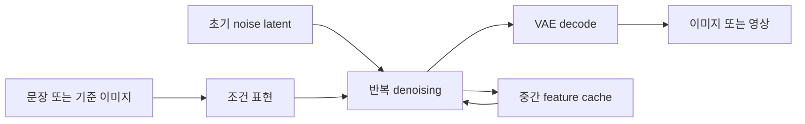

# 처음 읽는 학생을 위한 기초와 연구 Build-up

이 자료는 연구 후보를 고르기 위한 설계 문서다. 성능 결과는 아직 없다. 숫자로 적은 합격 기준은 사전 제안이며 측정값이 아니다. 사용 가능한 자원은 교수님이 확인한 **24–32GB급 단일 GPU**다.

## 1. 기존 ViT 경험에서 무엇을 가져올까

- 가져올 것: Transformer block 읽기, attention/MLP 구분, activation 수집, layer별 변화 분석, 실제 실행시간 측정 습관.
- 새로 배울 것: 생성 모델은 같은 network를 서로 다른 noise level에서 여러 번 실행한다. feature가 비슷해 보여도 작은 오차가 뒤의 sampling 경로에 영향을 준다.
- 연구 질문의 변화: “어느 layer에서 token을 없애면 좋은가”에서 “어떤 상태를 저장하고, 언제 정확한 계산으로 갱신해야 실제 비용이 줄면서 품질이 유지되는가”로 이동한다.
- Layer별 분석은 필요할 수 있지만 기여 자체로 확정하지 않는다. 분석 결과가 실제 정책과 재현 가능한 실패 조건을 바꾸는지 확인해야 한다.

## 2. 생성 과정 한 장

- Latent는 픽셀보다 작은 내부 표현이다. VAE decoder가 마지막 latent를 픽셀로 바꾼다.
- DiT는 이 내부 표현의 patch들을 Transformer로 처리하는 denoiser다. VLM 앞단의 vision encoder와 역할이 다르다.
- Diffusion과 flow matching은 학습 목적·sampling 식이 같지 않다. 둘 다 반복 network 평가가 나타날 수 있다는 공통점만 이용하고, scheduler 식은 실제 모델에 맞춘다.
- 근거 읽기: [Latent Diffusion](https://arxiv.org/abs/2112.10752), [DiT](https://arxiv.org/abs/2212.09748), [Flow Matching](https://arxiv.org/abs/2210.02747). 모두 이번 세션에서 abs 페이지 실존·내용 확인.

## 3. 세 개의 축을 분리하자

| 축 | 뜻 | 재사용하는 값 | 주의점 |
|---|---|---|---|
| denoising step s | 한 결과를 완성하는 noise 제거 반복 | 직전 step의 block output/residual | 오래 재사용하면 sampling 경로가 달라질 수 있음 |
| network block l | 한 network 호출 안의 깊이 | 일부 block 계산을 이전 step 값으로 대체 | 중간 입력이 바뀌므로 독립 오차 합으로 단정 불가 |
| video frame/chunk τ | 생성되는 영상의 시간 | 앞 chunk feature 또는 attention K/V | 실제 움직임과 정체성 보존, persistent state 오염 문제 |

- LLM의 autoregressive KV cache, video 모델의 causal history KV cache, denoising feature cache는 다른 상태다. 저장 목적·수명·정확성 조건부터 써야 한다.
- Video model이 모든 frame을 동시에 denoise하는지, chunk별 autoregressive 방식인지 먼저 확인한다. 모든 video 모델에 persistent KV가 있다고 가정하지 않는다.
- Few-step는 반복 횟수가 적다는 뜻이다. 많은 step에서 잘 되는 방식이 few-step에서도 같은 이득을 준다고 추론하지 않는다.
- [X-Cache](https://arxiv.org/abs/2604.20289)는 chunk 사이 재사용과 KV 갱신 시 full compute를 이미 다룬다. 이것을 새 아이디어로 다시 제안하지 않는다.

## 4. 캐시가 빠르게 만드는 이유와 느리게 만드는 이유

- Full compute는 expensive block을 실행한다. Cache hit는 저장한 값을 읽거나 예측값을 만들고 그 block을 건너뛴다.
- Cache에는 feature 저장, load/store, 예측용 history, gate 계산, CPU/GPU synchronization 비용이 붙는다.
- `skip ratio`는 계산을 생략한 비율이다. `speedup`은 실제 전체 실행시간의 비율이다. 둘은 같지 않다.
- Cache 용량은 논리 tensor 크기와 실제 storage 보유량이 다를 수 있다. View는 원본 storage 전체를 붙잡을 수 있다.
- Model weights, cache states, attention workspace, VAE decode workspace, allocator reservation을 구분해 기록한다.

**analytic 식**

`T_base = T_fixed + T_denoise`

`T_cache = T_fixed + T_remaining + T_gate + T_predict + T_memory + T_sync`

`speedup = T_base / T_cache`

- 실제 비중을 모르면 speedup 숫자를 예측하지 않는다.
- 예시만 보자: denoising 비중 0.80, denoising 시간 절반 감소, 추가 overhead 전체 baseline의 0.05라 가정하면 `1/(0.20+0.40+0.05) = 1.54×`다. **analytic 예시이며 우리 기법 결과가 아니다.**
- 동일 과정에서 denoising 비중이 0.40이라면 같은 가정의 값은 `1/(0.60+0.20+0.05)=1.18×`다. 전처리와 decode가 커지면 기대 이득이 작아진다.

## 5. 비슷한 feature가 안전한 feature인가

- Cosine similarity가 높더라도 작은 중요 영역이나 고주파 세부가 손상될 수 있다.
- 현재 latent에서 full compute해 얻은 값은 “한 번도 caching하지 않은 trajectory의 같은 step 값”과 같지 않을 수 있다. 이전 step의 근사 오차가 이미 현재 latent에 들어 있기 때문이다.
- Counterfactual 실험에서는 같은 prompt/seed에서 full trajectory와 cache trajectory를 둘 다 보존한다. Local residual error와 최종 품질을 따로 비교한다.
- 고정 seed의 PSNR/SSIM/LPIPS는 full-compute 결과와의 유사성을 재는 fidelity 지표다. 그 결과가 좋은 영상이라는 뜻까지 증명하지 않는다.
- 생성 품질은 prompt 충실도, subject consistency, temporal flickering, motion 등의 분리된 축으로 확인한다. [VBench](https://arxiv.org/abs/2311.17982)의 dimension 정의를 먼저 읽는다.
- 정지 영상은 temporal consistency가 좋아 보일 수 있다. Motion이 줄어드는 편법을 잡기 위해 dynamic degree와 prompt의 동작 요구를 함께 확인한다.

## 6. 읽는 순서와 읽고 남길 것

| 순서 | 읽을 자료 | 읽고 제출할 것 |
|---|---|---|
| 1 | Latent Diffusion / DiT | 입력 tensor → block → scheduler → decoder 그림 |
| 2 | [TeaCache](https://arxiv.org/abs/2411.19108) | 무엇을 관측하고 무엇을 생략하는지 표 |
| 3 | [TaylorSeer](https://arxiv.org/abs/2503.06923) | 단순 reuse와 history 기반 prediction의 차이 |
| 4 | [AdaCache](https://arxiv.org/abs/2411.02397) | motion을 이미 고려한 부분과 미검증 범위 |
| 5 | [BudCache](https://arxiv.org/abs/2606.13496), [EpaCache](https://arxiv.org/abs/2608.29264) | budget·오차 전파가 이미 다뤄진 범위 |
| 6 | [GP-Refiner](https://arxiv.org/abs/2609.05981) | uncertainty 기반 refresh까지의 경쟁 수준 |
| 7 | 후보 문서의 closest competitor | 제안이 기존 기법과 다른 한 문장, 틀릴 조건 |

## 7. 실험 난사를 피하는 Build-up

1. **응용의 실패를 한 문장으로 쓴다.** 예: 캐시를 켜면 생성은 빨라지지만 목표 메모리에서 해상도를 유지하지 못한다. 이 문장은 아직 검증할 가설이다.
2. **원인을 분해한다.** State의 실제 bytes·생존 구간·재사용 횟수와 gate/predict 비용을 기록한다.
3. **가장 단순한 반론을 먼저 실험 설계에 넣는다.** cache 수 제한, predictor order 고정, 단순 주기 refresh, 기존 offload, 단계 종료 시 cache release만으로 해결되면 복잡한 정책의 필요성이 약하다.
4. **한 개의 결정적 비교를 정한다.** 같은 hardware·quality·memory cap에서 제안과 가장 가까운 기존 기법을 비교한다.
5. **실패하면 가설을 수정한다.** 모델·seed·threshold를 결과가 나올 때까지 바꾸지 않는다. 변경 이유와 새 가설을 남긴다.

## 8. 최소 실험 기록표

| 분류 | 기록 항목 |
|---|---|
| 환경 | GPU 이름/VRAM, driver, CUDA, PyTorch, diffusers commit, precision, attention backend |
| 모델 | checkpoint repo + revision, scheduler class/config, guidance, quantization/offload/compile |
| 입력 | prompt ID, category, seed, 해상도, frame 수, step 수 |
| 시간 | warm/cold 구분, end-to-end, denoiser, gate/predict/copy/decode 각각 |
| 메모리 | peak allocated/reserved, unique storage bytes, model/cache/workspace 분해 |
| 품질 | full-compute와의 paired fidelity, 응용별 품질, 실패 사례/최악 구간 |
| 정책 | refresh step/block, state age/order/dtype, fallback, 실제 cache hit |

- Full run과 cache run의 seed만 같다고 RNG 소비 순서까지 같지는 않다. 초기 latent를 저장해 재사용한다.
- CUDA는 비동기이므로 CPU timer만으로 GPU 구간을 재면 안 된다. CUDA event와 명시적 동기화 경계를 사용한다.
- Profiling run과 성능 run을 분리한다. Profiler overhead가 들어간 latency를 headline으로 쓰지 않는다.
- 동일 prompt/seed 반복은 timing noise 평가다. 품질 일반화는 다른 prompt/seed로 평가한다.
- 하이퍼파라미터는 calibration set에서 고정하고 held-out set에 적용한다. 모든 방법에 같은 tuning budget을 준다.

## 9. 처음 네 단계

- **읽기**: block, scheduler, VAE decode를 코드에서 찾아 앞의 세 축을 표시한다.
- **재현 설계**: no-cache와 공개 baseline 하나의 설정을 고정한다. 지금 문서는 실행을 대신하지 않는다.
- **짧은 반증**: 각 후보의 quick-check를 사용한다. 실패하면 그 후보의 중단/축소 조건으로 간다.
- **확장**: 성공한 경우에만 다른 모델 family와 workload로 확장한다.

## 용어

- DiT — Diffusion Transformer, latent patch를 처리하는 생성 network.
- VAE — Variational Autoencoder, 픽셀과 latent 사이를 바꾸는 encoder/decoder.
- CFG — Classifier-Free Guidance, 조건부·무조건부 예측을 조합하는 방식; distilled guidance 모델에서는 구현이 다를 수 있다.
- Residual — block이 입력에 더하는 변화량; 원본 hidden state 전체와 구분한다.
- Cache age — 마지막 정확한 계산 이후 지나간 재사용 거리.
- Fidelity — 기준 출력과 닮은 정도; 주관적 품질과 동일하지 않다.
- Ablation — 한 요소만 제거하거나 바꿔 효과의 원인을 비교하는 실험.
- Pareto frontier — 한 지표를 개선하면 다른 지표가 악화되는 대안들의 경계.
- Calibration — test 전에 설정/예측기를 맞추는 별도 데이터 단계.
- OOM — Out Of Memory, 필요한 실제 할당이 사용 가능한 메모리를 넘은 상태.

## Gate Ledger
GATE primer-reference · ran · arxiv abs LDM/DiT/Flow Matching/VBench 및 P0 search logs; 문헌별 설명은 연구 결과와 분리 · 2026-09-22
GATE primer-experiment · skipped · harness scope는 설계; 모델 다운로드·GPU 실행 없음 · 2026-09-22
